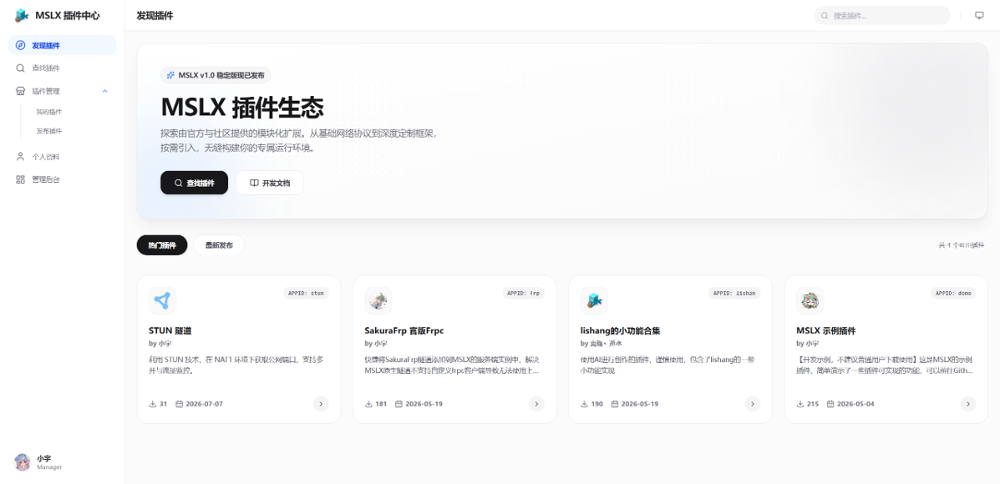

## V1.4 版本更新总结

**V1.4** 版本于 **2026-05-01 17:41:43** 发布，经过10个小版本迭代后于 **2026-07-08 12:41:16** 正式发布 **v1.4.10.1** 版本结束了整个 **v1.4** 版本的开发。

此大版本着重对**「插件系统」**进行了支持与完善。

<LinkCard icon="download" title="下载 MSLX" href="/docs/install/start/" />

<RepoCard repo="MSLTeam/MSLX" />

@[bilibili](BV1caN36UEK7)

### 插件系统

全新的插件系统可以为您的MSLX安装额外的功能，提供更丰富的开服管理体验。

### 插件生态

插件开发平台 & 插件开发文档，欢迎开发新的插件~

### SSL配置功能

启用HTTPS访问，保护您的数据安全。

### MCDR 服务端支持

新增对MCDR托管服务端支持（感谢@alright-qwq 对本功能的贡献）。

### 功能优化 & Bug修复······

- refactor(webpanel): 重构样式设置组件
- feat(webpanel): 实例控制台输入框新增历史记录功能 (上下方向键切换) #129
- chore(webpanel & daemon): 可设置强制最大退出时间又120s增加到300s
- fix(daemon): 修复部分压缩包在添加时jar包检测错误的问题
- fix(webpanel): 修复地图渲染器功能遇到未知方块颜色污染后续渲染的问题 #132
- feat(daemon): 游戏玩家列表新增中文匹配支持 #133
- fix(webpanel): 修复网页控制台登录页面在黑暗模式下背景图不正常缩放的问题
- fix(webpanel): 修复上传失败进度条回退0的问题
- perf(webpanel): 优化弱网状态下的上传文件成功率
- fix(daemon): 修复Linux自动更新失败 
- fix(daemon): 修复针对部分特定服务端(如Youer端的首次启动)会产生子进程运行的情况导致状态错误判断为关闭的问题(此类情况只能监听日志输出,没办法输入命令了)
- style(webpanel): 优化终端的滚动效果 #142
- fix(webpanel): 修复创建实例上传文件的进度条进度由于小数导致的宽度乱跳问题 #141
- feat(daemon & webpanel): 初始化/重置默认账户时，会生成一个包含默认账户密码信息的文本文件在数据目录
- feat(webpanel): 文件编辑器新增保存不关闭的功能 #147
- feat(webpanel): 在非本地/局域网环境下新增HTTP协议访问的安全警告
- feat(webpanel): 服务端选择组件新增服务端简短描述介绍
- 等等等等······ | 详情可见：[https://mslx.mslmc.cn/msl-changelogs/](https://mslx.mslmc.cn/msl-changelogs/)

## V1.5 版本开发计划

V1.5 版本主要支持内容为「**容器化部署服务端实例**」，目前已更新到 **v1.5.2** 版本，已完成对容器启动的初步支持，欢迎体验！

