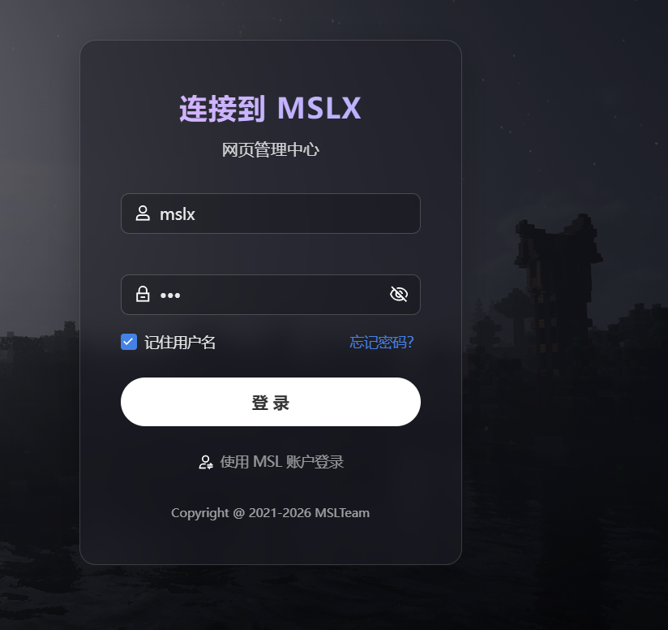
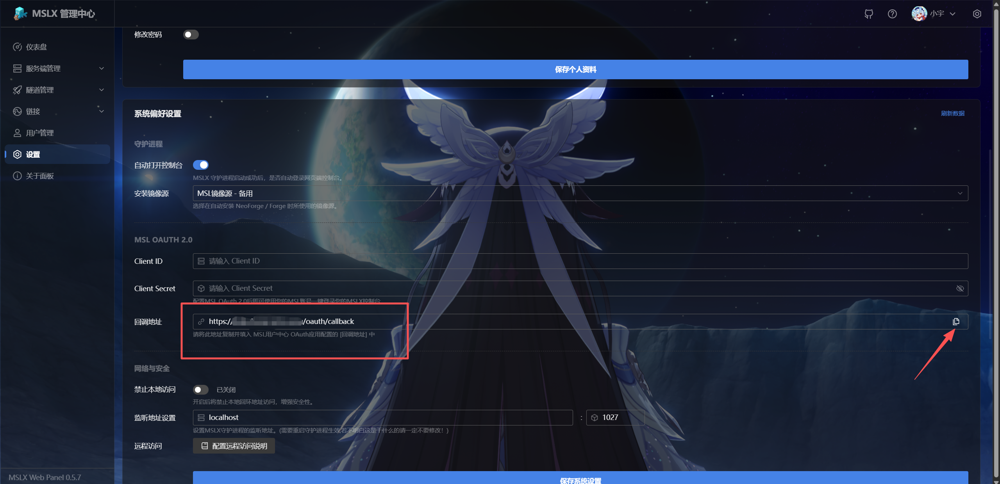
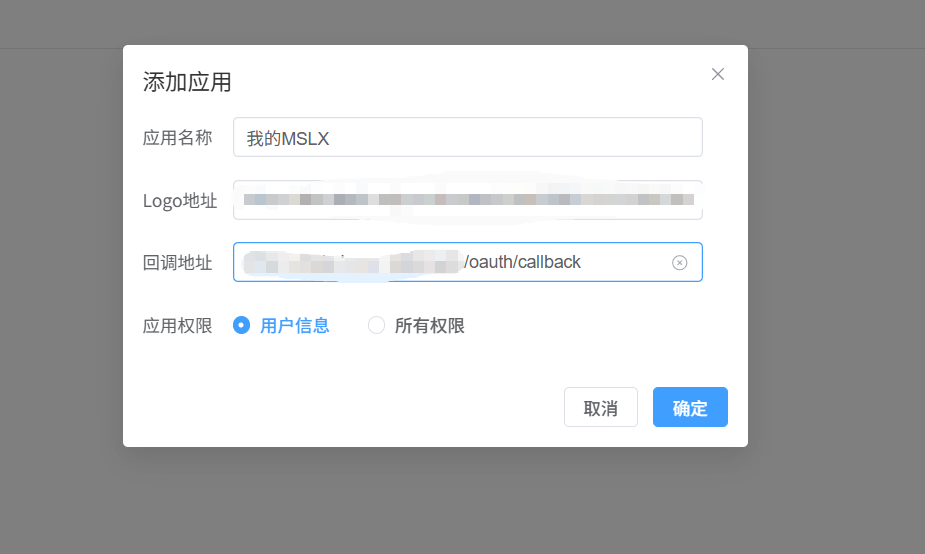
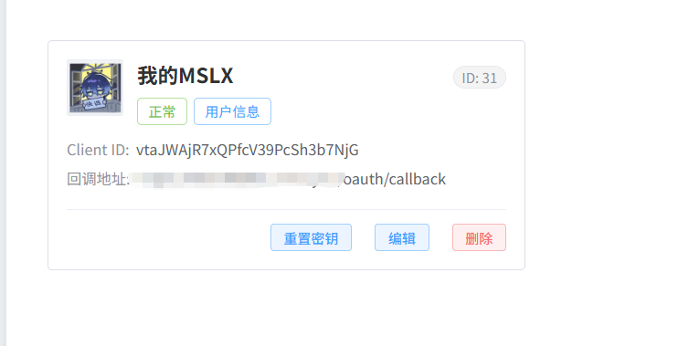
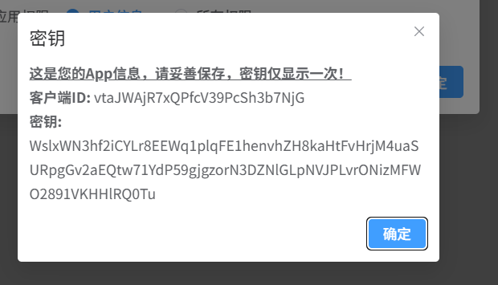
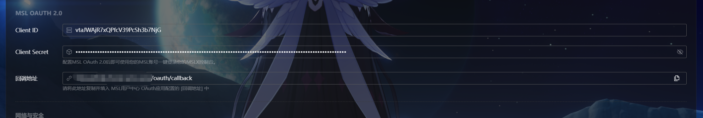
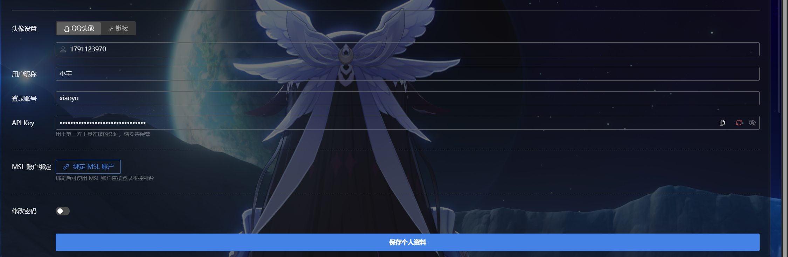
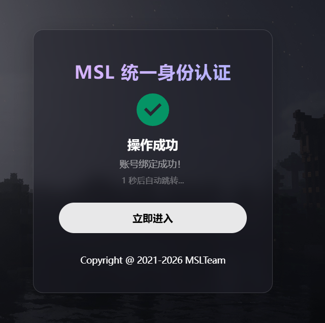

::: tip

配置此内容后可以在您的MSLX中直接使用您的MSL用户中心的账号进行快捷登录，方便&安全！

:::

## 注册MSL OAuth 2.0 APP

进入MSL用户中心的OAuth App管理页面，点击添加应用。

[MSL OAuth App管理](https://user.mslmc.net/user/oauth){.readmore}

配置好应用名称（随便写），logo地址（可选），回调地址（需要在MSLX设置中复制），权限选择用户信息即可。

注册成功后，请保存显示的 ==ID和Secret信息== 。

注意：您需要 ==联系管理员== 对App信息进行审核方可正式启用。

## 在MSLX配置 MSL OAuth 2.0

进入设置页面，将获取到的ID和密钥信息进行填入即可。

==记得点击保存哦~==

## 绑定和登录

保存配置后，即可在上方用户信息处进行绑定MSL账号。

绑定成功后就可以使用MSL账号一键登录您的MSLX面板啦~

