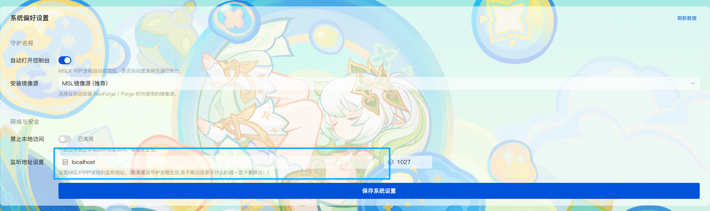
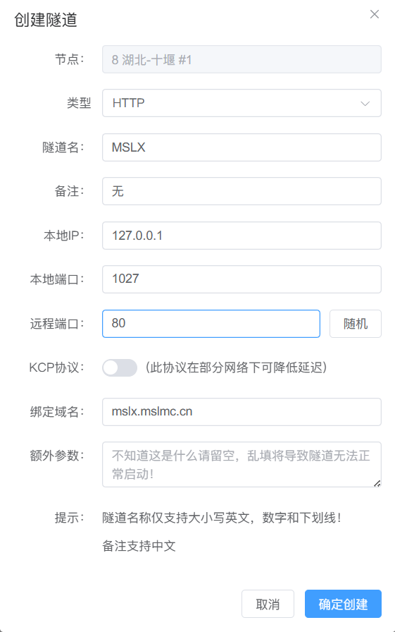

由于MSLX的设计架构，您很容易配置远程访问。

注意：当前MSLX桌面版客户端尚在研发中，所以这里暂时只介绍如何配置面板的远程访问。

## 环境要求

强烈建议您的环境需要 ==支持Websocket== 。

!!其实没有WS也能跑的，前端会自动切换到长轮询的模式，就是性能......!!

::: important 安全须知

我们强烈建议您在部署远程访问的时候添加 ==SSL=={.important} 支持。（用nginx之类的反向代理一下）。

否则，直接暴露出去就是完全不加密的。

:::

## 放行公网访问

::: tip 这需要公网IP

如果你没有公网IP，可以直接看下一个段落的。

:::

::: important 更建议的方案

我们更建议使用nginx等软件，进行本地反向代理并添加 ==SSL证书=={.important}，然后通过其访问 ，以增强安全性。

:::

由于安全考虑，MSLX守护进程默认监听`localhost`，若需要公网访问，您需要把监听地址修改为`0.0.0.0`，或者是您的网卡IP地址，也行。不懂就直接设置`0.0.0.0`是最快的。

::: tip 关于远程访问

守护进程端默认监听`1027`端口，若您配置监听`0.0.0.0`地址后仍无法访问，请检查系统防火墙配置防火墙 (ufw/iptables)，以及服务商防火墙配置（如果是带额外防火墙功能的云服务器）。

:::



我的服务器是纯命令行环境，进不去网页控制台怎么办？

我们也提供了启动参数的配置模式：（只要用过一次启动参数，默认就会写入配置，下一次也会自动沿用配置）

```shell
MSLX.Daemon --host 0.0.0.0 --port 1027
```

## 使用内网穿透

由于大部分家庭宽带均没有 ==公网IP== ，那就只能内网穿透咯。

::: important 更建议的方案

我们更建议使用nginx等软件，进行本地反向代理并添加 ==SSL证书=={.important}，然后使用Frp的HTTPS隧道。

:::

如果不考虑SSL，可以直接使用Frp的`HTTP/TCP`隧道映射端口`1027`（这是MSLX守护进程默认端口，如果你修改了，那就对应修改Frp配置即可）。


