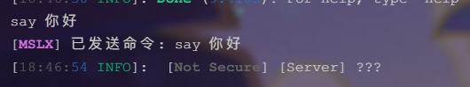
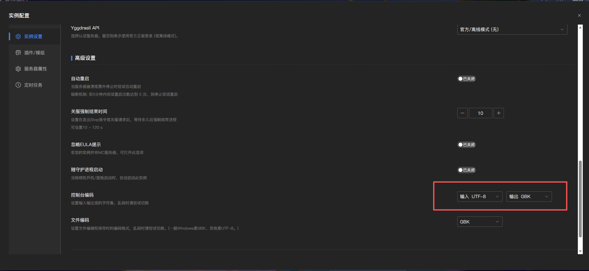
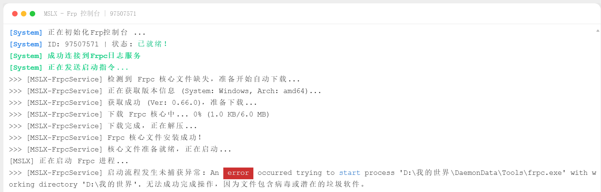
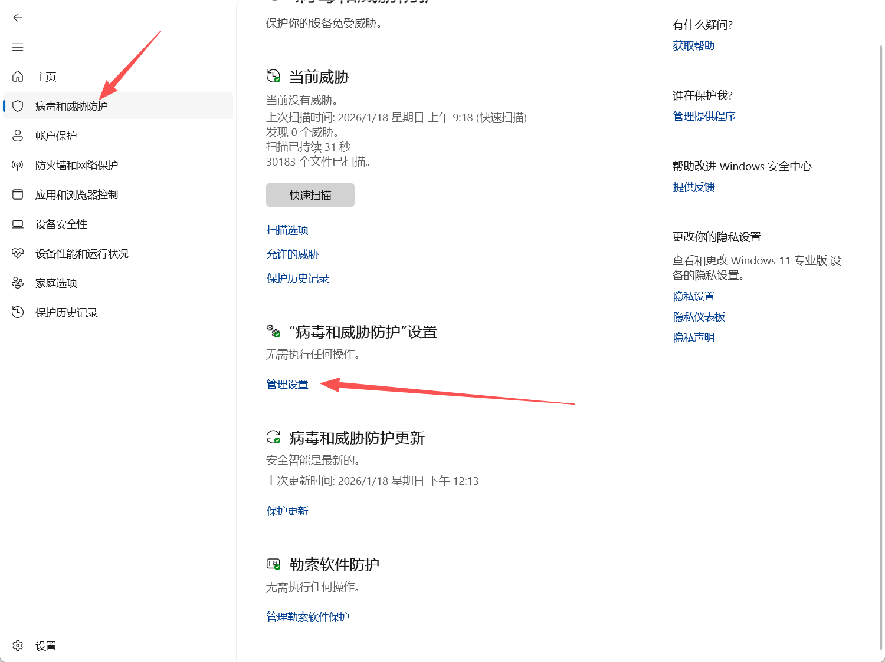
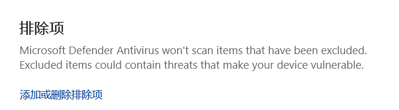
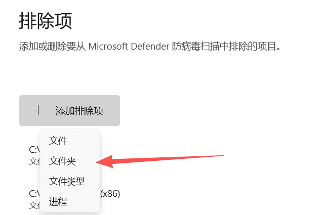
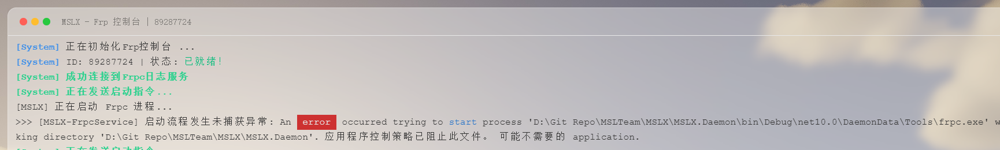
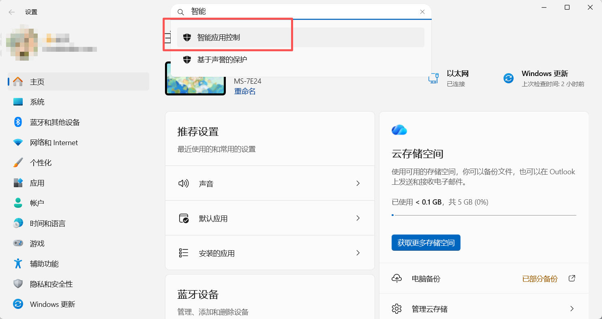
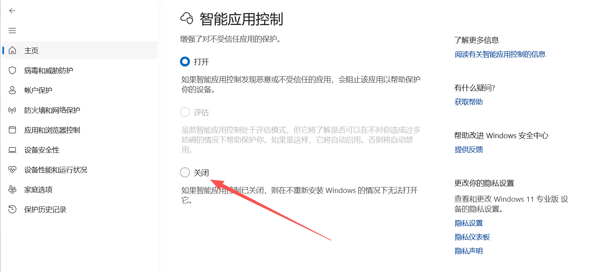
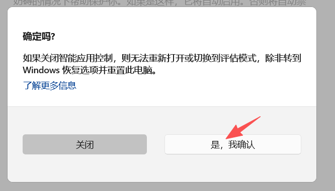

::: tip 善用搜索

善用 ==搜索== 功能，也许可以帮您快速找到您的问题的解决方案~

如果这里的常见问题都没能解决您的问题，您可以在右侧找到我们的 ==QQ交流群== 加入与群友们探讨解决。

:::

## 服务器日志乱码/输入中文指令内容乱码或"???"

#### ❔问题呈现：

日志输出是乱码符号：

或者输入指令包含中文时无法识别，变成“？？？”：

又或者是在控制台遇到其他的乱码情况，出现很多不认识的字符······

#### ✅解决方案：

进入实例设置，调整输入/输出的编码即可。（修改后保存重启才生效哦！）

如果是 ==Windows== 系统，那么一般是`输入UTF-8`/`输出GBK`。

如果是 ==Linux/macOS== 系统，那么一般`输入输出都是UTF-8`。

::: tip

如果按照上述方案修改后仍然乱码，可以尝试对这两个选项进行 ==排列组合== 测试，反正也就这几种组合。

正常来说，创建服务端时MSLX会根据当前的系统类型自动选择合适的编码，若非认为修改，一般都能直接正常使用。

!!当然，也可能是因为你修改了系统默认编码。比如简体中文版Windows默认是GBK，然后你改成了UTF8。!!

:::

## Frp(内网穿透)启动的时候报病毒/垃圾文件

#### ❔问题呈现：

==此问题仅在高版本Windows下存在==

#### ✅解决方案：

在任务栏中找到 ==Windows 安全中心== （又叫Windows Defender）,进入 ==管理设置== 。

拉到最下面，找到 ==排除项== 。

==添加排除项== ，并选择 ==文件夹==。

然后选择您 ==MSLX所在的文件夹== 即可。

操作完成后即可尝试再次启动Frp隧道。

## Frp(内网穿透)启动的时候报应用程序控制策略已阻止此文件， 可能不需要的 application。

#### ❔问题呈现：

==此问题仅在新版本Windows11上会出现，于2026-1-27遇到，情况是未签名的应用/dll库均不允许打开==

#### ✅解决方案：

打开 ==设置== ，搜索 ==智能应用控制== 。

选择 ==关闭== ，然后 ==确认==。

::: tip 这玩意用处不大，反而阻止了很多软件的使用，可以放心关闭。

:::
