::: warning 使用容器部署需要一定的使用经验

如果您没有使用过Docker部署服务，可能对你而言使用 ==直接安装=={.warning} 的方法会更加简单。

建议了解相关知识后再使用容器部署。

当然，本文档写的已经 ==尽量详细=={.warning} 新手也差不多能看明白并安装成功。

:::

::: tip 关于容器

当您将MSLX守护进程部署在容器运行后，您所有在MSLX上运行的 ==MC服务端/其他类型实例== 也均会运行在此容器上。

容器镜像自带了 OpenJdk 17 和 21版本环境，在创建服务端选择Java时可以直接选择 ==本地Java== 就能看见自带的Java环境了。

若这两个版本不符合您的MC版本要求，MSLX的 ==在线安装Java== 功能依旧 ==有效== 。

:::

::: important 系统架构支持

自 MSLX-Daemon ==v0.5.3.1-beta=={.important}  版本起，会自动构建 `amd64` 和 `arm64` 架构的镜像，拉取时会自动选择。

==我们不会对32位的架构做支持，其完全不适合用于开服。=={.important}

:::

## 容器镜像地址

MSL容器镜像源 (中国大陆/中国香港): `docker.mslmc.cn/xiaoyululu/mslx-daemon:latest`

Dockerhub: `xiaoyululu/mslx-daemon:latest`

==正常情况下建议直接拉取MSL容器镜像源，如果出现无法拉取的问题再使用Dockerhub源（可能需要配置加速镜像）==

## 手动安装

:::: steps
1. ### 安装Docker（已安装可跳过）

   ```shell
   # 安装curl（如果没有）
   apt install curl # 如果不是apt那就自己换一下
   # 安装Docker
   curl -fsSL https://get.docker.com | bash -s docker --mirror Aliyun
   # 将当前用户加入 docker 组
   sudo usermod -aG docker $USER && newgrp docker
   # 启动 Docker 并设置开机自启
   systemctl enable --now docker
   # 验证安装
   docker -v
   ```
   

   ::: tip 配置镜像源

   如果您使用Dockerhub来拉取镜像，您可能需要设置加速镜像才能正常拉取。（如何配置请自行查找）

   这里建议直接使用 ==MSL的容器镜像== 拉取，正常情况下还是比较快的。

   :::
   
2. ### 安装并启动MSLX守护进程 - 配置文件方法

   ```shell
   # 创建数据目录（也可以换成你喜欢的目录）并定位到目录
   mkdir -p /opt/mslx && cd /opt/mslx
   ```

   在这个文件夹新建一个配置文件`docker-compose.yml`。（可以直接在ssh的文件管理，也可以使用vim/nano等编辑工具）。

   输入以下配置文件（可以根据需要修改，不会改就默认即可）。

   ```yaml
   services:
     daemon:
       image: docker.mslmc.cn/xiaoyululu/mslx-daemon:latest
       # image: xiaoyululu/mslx-daemon:latest # 这是Dockerhub的仓库，如果需要从Dockerhub拉取，请取消这行注释并注释掉上一行。
       container_name: mslx-daemon
       restart: always
       
       # 端口映射
       ports:
         - "1027:1027"               # 服务面板端口
         - "25565-25585:25565-25585/tcp" # Java版游戏端口预留
         - "25565-25585:25565-25585/udp" # 基岩版游戏端口预留
         - "19132-19142:19132-19142/udp" # 基岩版游戏端口预留
       
       # 数据挂载
       volumes:
         - /var/run/docker.sock:/var/run/docker.sock
         - ./data:/app/DaemonData
       
       environment:
         - TZ=Asia/Shanghai
         # - host=* # 配置监听地址，默认是*，没有特殊需求不需要改
         # - port=1027 # 配置监听端口，没有特殊需求不需要改（改了的话上面的端口映射配置需要一起修改）
   ```

   ```shell
   # 启动
   docker compose up -d
   ```

   执行启动后，Docker会自动拉取镜像和启动MSLX守护进程端。

   如图即为成功：（如果`Created`后没有反应，可以按下回车，然后输入`docker ps -a` 查询状态）

   

3. ### 安装并启动MSLX守护进程 - 一键指令方法

   ::: tip
   如果已经根据步骤二启动过了，那么这一步请略过不看。

   ==更推荐步骤二的方法==

   :::

   ```shell
   docker run -d \
     --name mslx-daemon \
     --restart always \
     -p 1027:1027 \
     -p 25565-25585:25565-25585 \
     -v $(pwd)/mslx_data:/app/DaemonData \
     -v /var/run/docker.sock:/var/run/docker.sock \
     -e TZ=Asia/Shanghai \
     docker.mslmc.cn/xiaoyululu/mslx-daemon:latest
   ```

   或者使用Dockerhub源: 

   ```shell
   docker run -d \
     --name mslx-daemon \
     --restart always \
     -p 1027:1027 \
     -p 25565-25585:25565-25585 \
     -v $(pwd)/mslx_data:/app/DaemonData \
     -v /var/run/docker.sock:/var/run/docker.sock \
     -e TZ=Asia/Shanghai \
     xiaoyululu/mslx-daemon:latest
   ```

   

4. ### 查询默认账号信息和一些注意事项

   由于启动后可能没有日志输出，输入以下指令查询日志：

   ```shell
   docker logs -f mslx-daemon
   ```

   

   然后打开`http://localhost:1027`即可登入MSLX面板控制端。

   

   ::: tip 关于数据位置

   在您没有修改启动配置文件/指令的情况下：

   使用配置文件启动方法，默认数据保存在`/opt/mslx/data`。

   使用一键启动命令方法，默认数据保存在`当前目录/mslx_data`。

   :::

   ::: important 关于端口

   以上的默认配置会把docker的`1027`端口以及`25565-25585`端口映射到主机，开服可以优选选择25565以及后面这20个端口，就不需要额外配置。

   :::

5. ### 关闭/更新/重启MSLX

     #### # 关闭MSLX容器

     ```shell
     # 如果是配置文件的启动方式
     cd /opt/mslx && docker compose down
     ```

     ```shell
     # 如果是一键指令的方法
     docker stop mslx-daemon
     # 想再开就 docker start mslx-daemon
     ```

     #### # 重启MSLX容器

     ```shell
     docker restart mslx-daemon
     ```

     #### # 更新MSLX容器镜像

     更新不会删除数据，除非你自己删了。

     ```shell
     docker pull docker.mslmc.cn/xiaoyululu/mslx-daemon:latest
     docker rm -f mslx-daemon
     # 然后重新运行启动命令 (up -d)
     ```


  ::::

## 使用 fnOS (飞牛OS) Docker 管理器部署

<LinkCard title="(推荐) 安装飞牛应用商店版本MSLX" description="MSLX已上架FnOS的应用商店！可以更快捷的安装使用啦！" icon="b:debian" href="/docs/install/fnos/" />

::: important 手动安装的重要提醒

!!踩了很多坑之后得出的结论!!

建议完全按照本教程来部署MSLX在fnOS上，不然 ==更新会超级麻烦=={.important} 。

==切勿直接在镜像仓库安装MSLX=={.important} ，目前不知道为什么安装后无法检测更新。

:::

@[bilibili](BV1zfFBz4E6A)


:::: steps

1. ### 新建Compose项目

   来到飞牛管理页面的 ==Docker== 管理器内，切换到 ==Compose== 选项卡，点击 ==添加项目== 。

   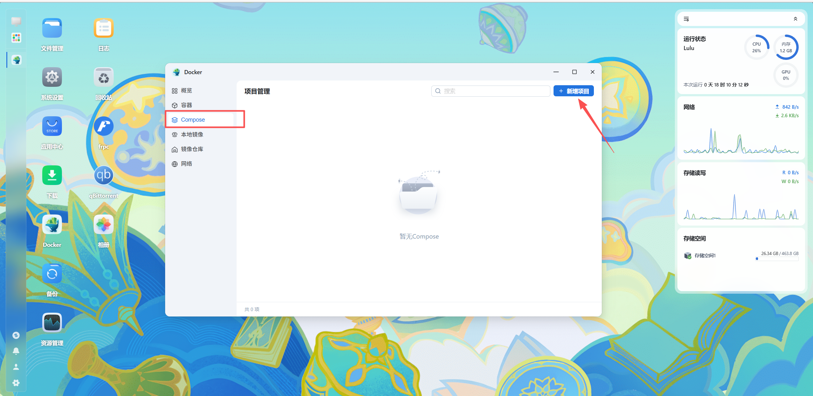

   输入项目名字（随便起），选择MSLX数据保存的位置，然后选择 ==创建docker-compose.yml== 。

   将以下配置文件粘贴进去。

   ```yaml
   services:
     daemon:
       image: docker.mslmc.cn/xiaoyululu/mslx-daemon:latest
       # image: xiaoyululu/mslx-daemon:latest # 这是Dockerhub的仓库，如果需要从Dockerhub拉取，请取消这行注释并注释掉上一行。
       container_name: mslx-daemon
       restart: always
       
       # 端口映射
       ports:
         - "1027:1027"               # 服务面板端口
         - "25565-25585:25565-25585/tcp" # Java版游戏端口预留
         - "25565-25585:25565-25585/udp" # 基岩版游戏端口预留
         - "19132-19142:19132-19142/udp" # 基岩版游戏端口预留
       
       # 数据挂载
       volumes:
         - /var/run/docker.sock:/var/run/docker.sock
         - ./data:/app/DaemonData
       
       environment:
         - TZ=Asia/Shanghai
         # - host=* # 配置监听地址，默认是*，没有特殊需求不需要改
         # - port=1027 # 配置监听端口，没有特殊需求不需要改（改了的话上面的端口映射配置需要一起修改）
   ```

   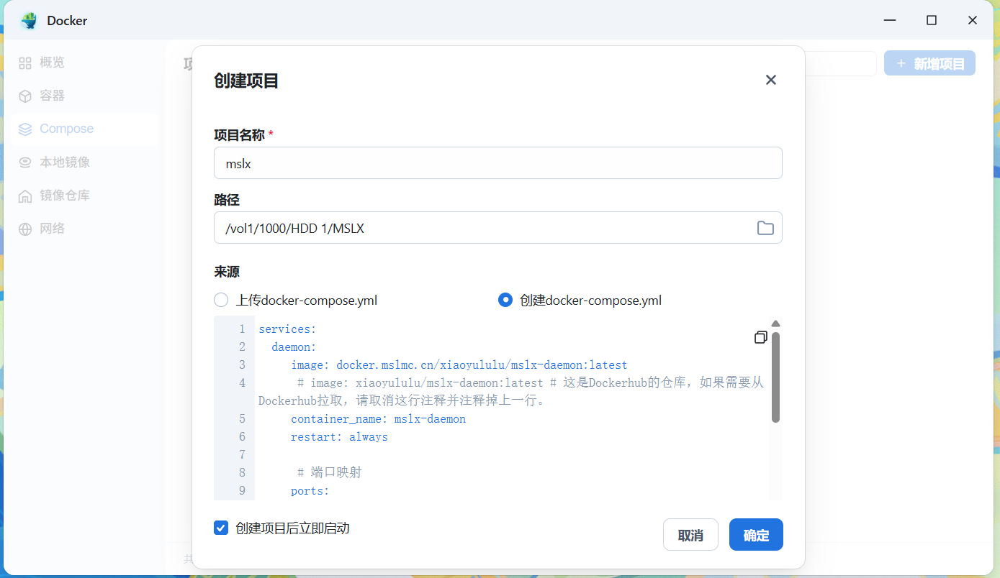

   确定创建即可，创建成功后启动项目。

2. ### 启动MSLX

   等待镜像构建成功后，进入 ==容器== 页面，查询 ==运行日志== 。

   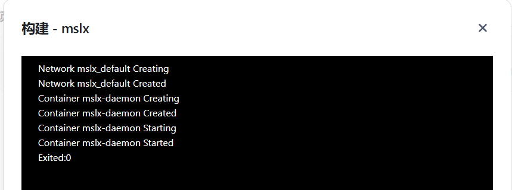

   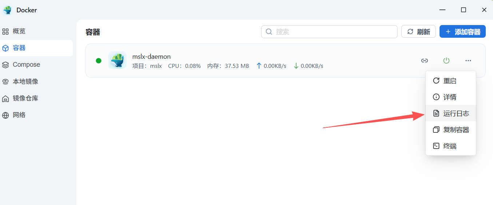

   在 ==运行日志== 中获取到初始的用户密码。

   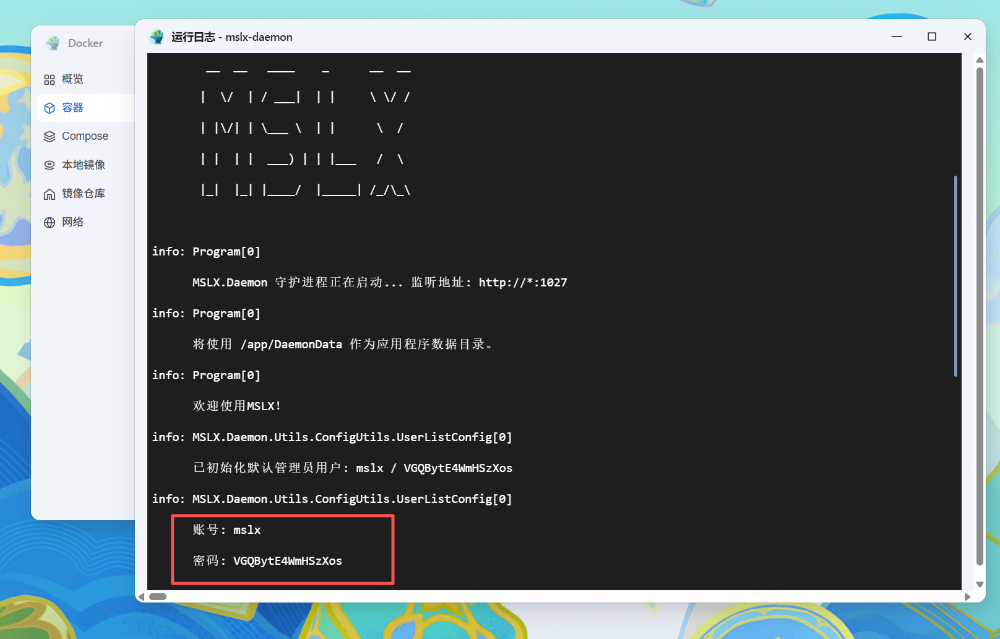

   然后访问 ==MSLX控制台== （如果这里`1027`端口跳转过去之后无法正常访问，请把协议头从`https`改成`http`）。

   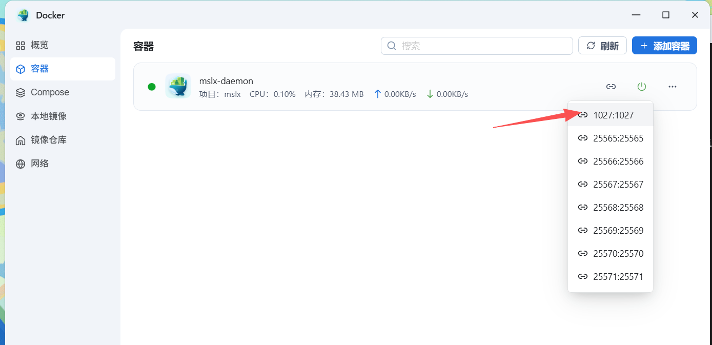

   使用 ==初始账号密码== 登录即可。（记得及时修改初始账户名和密码哦）。

   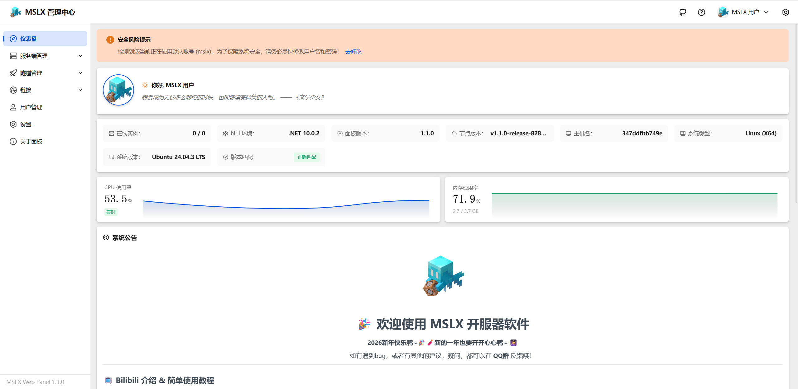

3. ### 更新方法

   !!由于不知道何种神秘力量影响，MSLX Docker镜像的更新在fnOS上无法检测到。!!

   来到 ==Compose== 页面，停止MSLX项目。

   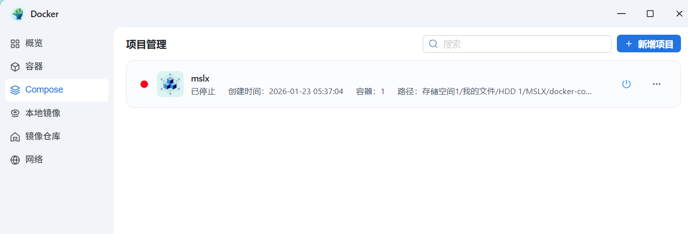

   然后来到 ==容器== 页面，删除`mslx-daemon`容器。（放心删，MSLX的数据文件存储在了你挂载的数据目录，是不会被删的。还不放心就备份一下吧。）

   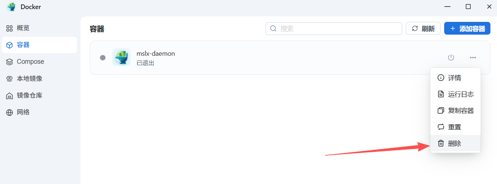

   再然后来到 ==本地镜像== 页面。删掉`***/xiaoyululu/mslx-daemon`这个镜像。

   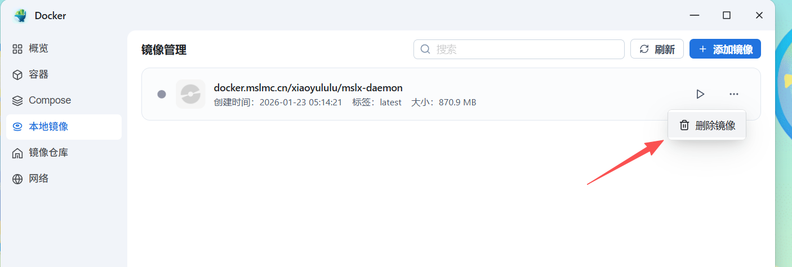

   最后，回到 ==Compose== 页面，重新启动MSLX项目即可，会自动拉取最新版本的镜像进行构建。

   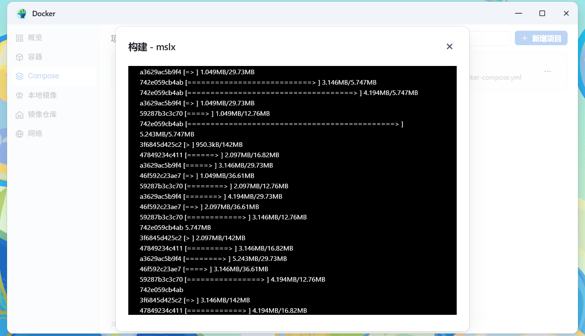

::::

## 使用 宝塔 的Docker管理部署

进入宝塔的容器页面。


选择 ==命令创建== ，然后输入一下指定，然后执行。（此命令中，默认把数据存在了`/www/wwwroot/mslx-daemon`，你也可以根据喜好编辑存储数据的位置）。

```shell
docker run -d \
  --name mslx-daemon \
  --restart always \
  -p 1027:1027 \
  -p 25565-25585:25565-25585 \
  -v /var/run/docker.sock:/var/run/docker.sock \
  -v /www/wwwroot/mslx-daemon:/app/DaemonData \
  -e TZ=Asia/Shanghai \
  docker.mslmc.cn/xiaoyululu/mslx-daemon:latest
```

或者使用Dockerhub源:

```shell
docker run -d \
  --name mslx-daemon \
  --restart always \
  -p 1027:1027 \
  -p 25565-25585:25565-25585 \
  -v /var/run/docker.sock:/var/run/docker.sock \
  -v /www/wwwroot/mslx-daemon:/app/DaemonData \
  -e TZ=Asia/Shanghai \
  xiaoyululu/mslx-daemon:latest
```


等待创建完成后，进入容器详情，查询日志即可获取 ==默认管理账号密码== 。

然后即可访问控制台进行登录访问（建议额外配置nginx反向代理）。


::: warning bug?

测试时发现命令创建成功后容器详情 ==没有正确读取到命令配置的端口映射=={.warning} ，不知道是啥问题（可能是宝塔不能识别范围端口）。

如果遇到无法使用的情况，可以参照第一步手动安装。

也可以尝试创建容器内的 ==手动创建=={.warning} 方法，按照指令填写参数（如果你会的话）。

:::

## 使用 1Panel 部署

::: tip

由于1Panel原本就是容器化的面板，确实会比较的适合。

:::

在容器页面进行新增容器，按以下配置。

镜像：`docker.mslmc.cn/xiaoyululu/mslx-daemon:latest` 或者使用Dockerhub源: `xiaoyululu/mslx-daemon:latest`

端口：`1027`是 ==必须映射== 的，这是面板默认服务端口。25565-25585是预留的MC服务器端口，可以自行修改。


==挂载== （服务器内目录也可以更改为自己喜欢的目录，容器内目录必须是`/app/DaemonData`）。


==环境变量== 推荐配置：`TZ=Asia/Shanghai`。


==重启规则== 按照自己喜好即可。


然后确定，等待任务完成即可。


查询日志即可找到 ==默认管理账号密码== ，然后访问您的IP地址+1027端口即可访问面板（建议套一层nginx反向代理哦！）

