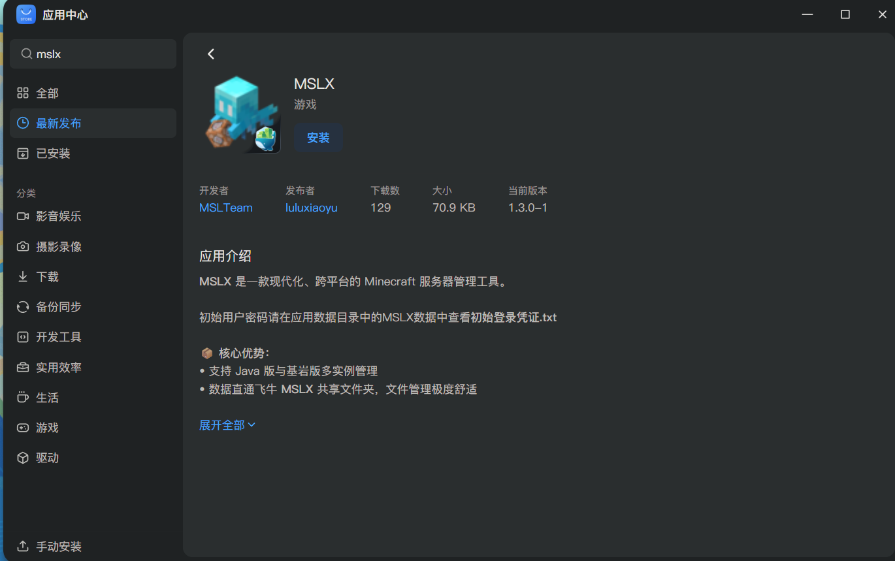
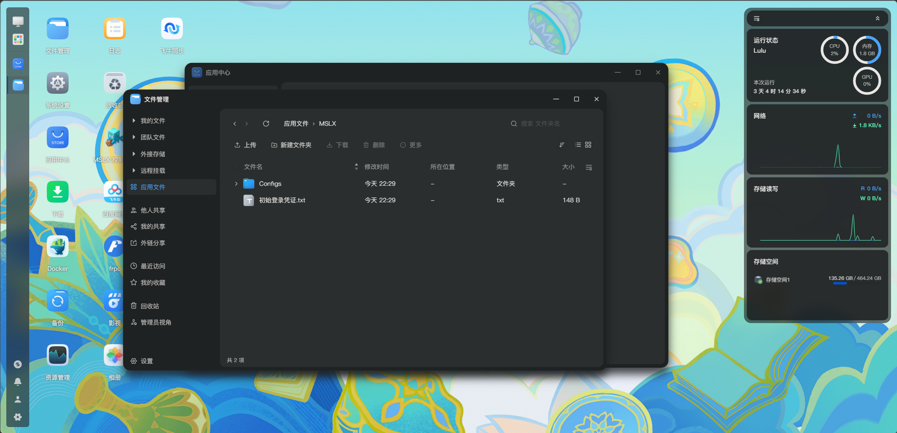

<LinkCard title="使用 FnOS Docker 管理器" description="在FnOS上除了可以直接在应用商店安装，也支持使用Docker管理器手动部署" icon="b:docker" href="/docs/install/docker/#使用-fnos-飞牛os-docker-管理器部署" />

::: important 版更说明

受限于飞牛的应用商店的更新审核机制，MSLX主线的更新无法立即同步到飞牛应用商店中。

飞牛商店版本大概是 ==每周会同步一次主线版本更新=={.important} ，可直接在商店中更新。

若希望及时用上新版本，可以参考上方`使用 FnOS Docker 管理器`。

:::

## 视频安装教程

@[bilibili](BV1krcSzaE34)

## 文本安装教程

:::: steps

1. ### 在应用商店安装MSLX

   在应用商店中搜索`MSLX`，然后进行安装。

   注意选择安装位置，==后续您的所有MC服务端文件均存放在此处== 。

   

2. ### 查询初始账户密码信息

   安装完成后，进入以下路径查询初始账户信息：`文件管理 → 应用文件 → MSLX → 初始登录凭证.txt`。

   

   复制里面的密码即可。

3. ### 登录到MSLX控制台

   从桌面的MSLX图标点击进入MSLX控制台，使用刚才复制的账户密码即可完成登录（记得立即修改初始账户密码哦）。

   ::: tip 关于端口

   MSLX使用的是NAS设备的`1027`端口，请确保可以正常访问。

   :::

::::