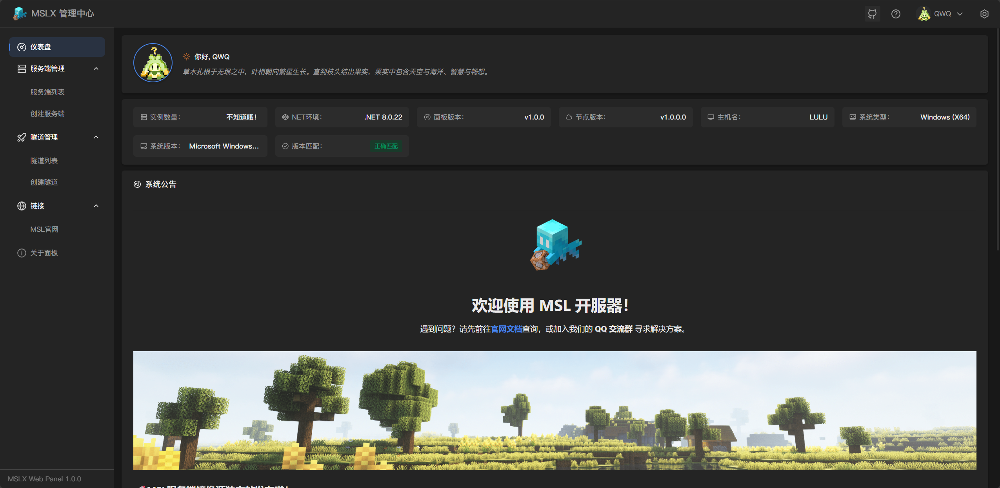

<DownloadMSLX />

## 关于 MSLX

==MSLX== 是由 [**MSL**](https://www.mslmc.cn) 原班团队 **MSLTeam** 倾力打造的全新一代开服工具。基于 ==.NET Core 10.0== 环境。

它传承了 MSL 经典的 UI 设计语言，旨在让操作零门槛——无论是老用户还是新伙伴，都能即刻上手，极速部署您的 MC 服务器。

MSLX 不仅 ==完美支持跨平台== (Windows / macOS / Linux) 运行，相比前代，更引入了强大的 ==远程访问== 功能，让管理更自由。

@[bilibili](BV13NkWBxEwg)

<RepoCard repo="MSLTeam/MSLX" />

## 与MSL的区别？

MSLX采用的是 ==前后端分离== 的模式。

简而言之，==Daemon== 端负责管理您的服务器，而 ==网页控制台/桌面客户端== 负责控制您的服务器管理器。

因此可以实现远程管理您的服务器，只需要使用 ==网页控制台/桌面客户端== 连接您守护进程的服务即可，您可以查阅相关文档完成此操作。

## 开发进度

目前 MSLX 发布了基于网页控制台的版本，基于AvaloniaUI的全平台客户端仍在开发中······

也欢迎大家尝试和积极[反馈问题和建议](https://github.com/MSLTeam/MSLX)哦~

## MSLX 技术栈

- ==MSLX Daemon== : ASP.NET Core (.NET Core 10.0 LTS)
- ==MSLX 网页控制台=={.important} : Vue3 + Pinia + TypeScrpt
- ==MSLX 桌面客户端=={.tip} : AvaloniaUI (.NET Core 10.0 LTS)

## 安装使用

==暂时仅提供 Daemon 守护进程端的安装==，桌面客户端仍在开发中······

<LinkCard title="在 Windows 上安装使用" icon="b:microsoft" href="/docs/install/windows/" />

<LinkCard title="在 macOS 上安装使用" icon="b:apple" href="/docs/install/macos/" />

<LinkCard title="在 Linux 上安装使用" icon="b:ubuntu" href="/docs/install/linux/" />

<LinkCard title="在 Docker 上安装使用" icon="b:docker" href="/docs/install/docker/" />
