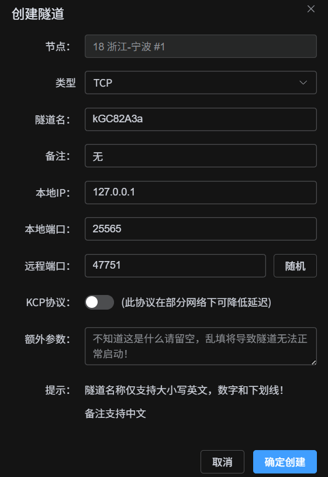
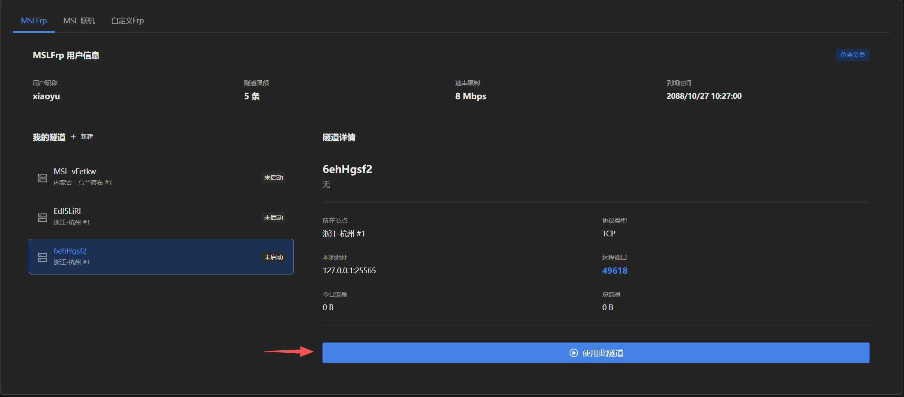
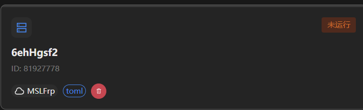
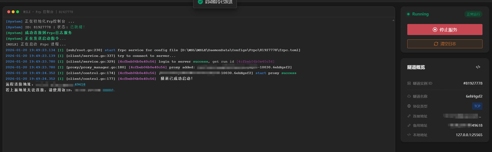
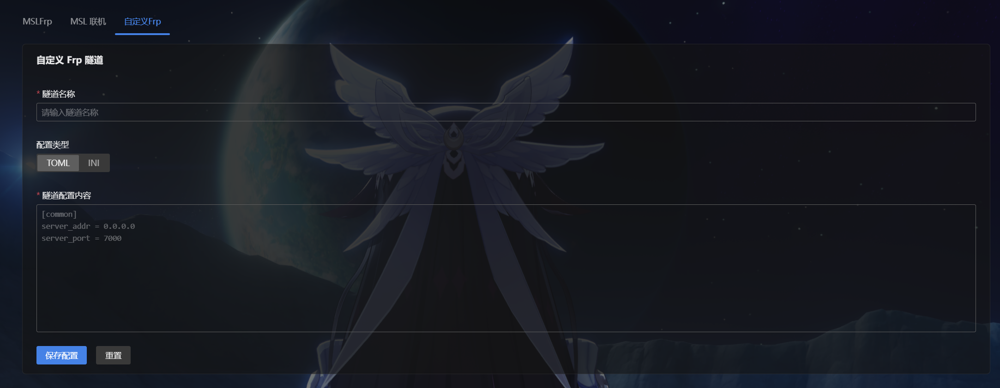

::: tip 内网穿透（Frp）

[这是什么？ 前往**GoFrp项目官网** 了解](https://gofrp.org/zh-cn/){.readmore}

简单来说，就是把 ==内网的服务映射到公网== 。

由于很多家庭宽带是不提供 ==公网IP== 的，想用家里的电脑/没有公网IP的设备开服就需要用到内网映射服务，将您的服务器映射到公网以让其他小伙伴加入游玩！

:::

## MSLFrp

<LinkCard title="MSLFrp" icon="cloud" href="https://user.mslmc.net" >

MSLFrp是嵌套于 ==MSL用户中心== 的服务。

本服务由MSLTeam与广州兮辰云科技联合提供。

</LinkCard>

:::: steps

1. ### 登录到MSLFrp

   首先，进入MSLX的 ==添加隧道== 页面，登录到MSL账户。

   若未注册MSL账户，请先前往 ==MSL用户中心== 注册账户。

   [MSL用户中心](https://user.mslmc.net){.readmore}

2. ### 添加隧道

   点击添加隧道，会跳转到 ==MSL用户中心== 的隧道管理页面，需要在这里新建隧道（如果是Java版本服务端，端口和协议都是默认不需要修改的）。

   

3. ### 导入隧道到MSLX

   创建隧道后，回到MSLX的 ==创建隧道== 页面，并刷新，选择刚才新建的隧道，添加即可。

   

4. ### 启动隧道

   回到 ==隧道列表== 页面，点击你刚才创建的隧道进入启动页面。

   

   ==启动== 隧道，成功后即可使用 ==连接地址== 进入您的MC服务器。（右侧的连接地址单击后可以快捷复制的哦~）

   

::::

::: tip

由于内网穿透的特性，默认情况下通过内网穿透进入的玩家IP都是`127.0.0.1`。

这可能导致部分登录插件识别到是同一台电脑的玩家登录，也可能导致封禁使用`/ban-ip`后全员进不去。

通过调整登录插件的配置，以及不使用`/ban-ip`是个比较好并且简单的方案（或者使用外置验证登录）。

如果还是希望获取玩家真实IP，请看这里：

[教程 - **Frp获取用户真实IP**](/docs/proxy/frp-real-ip/){.readmore}

:::

## 其它Frp

更多Frp服务商仍在陆续适配中，若现阶段需要使用其他服务商的服务，可以参考下面 ==自定义Frp== 的说明进行创建隧道。

## 自定义Frp

选择 ==高级模式==，粘贴配置文件进去就好~（建议`toml`格式）。

通过此模式您可以快速启动MSL尚未接入的第三方Frp服务提供商。

