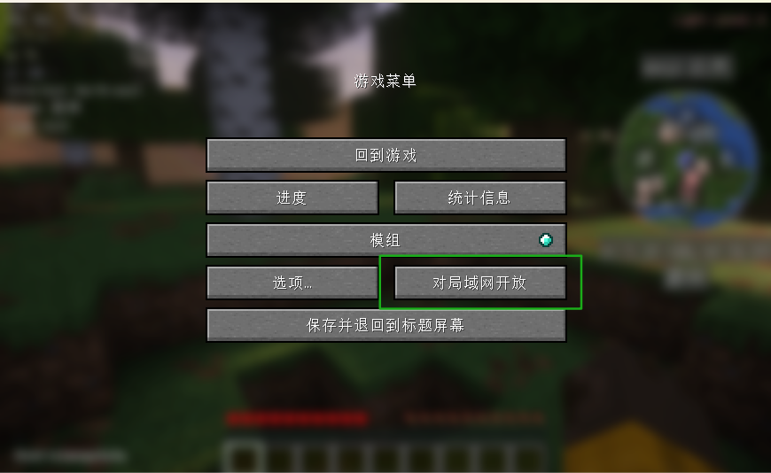
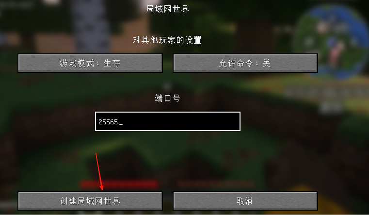
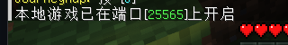
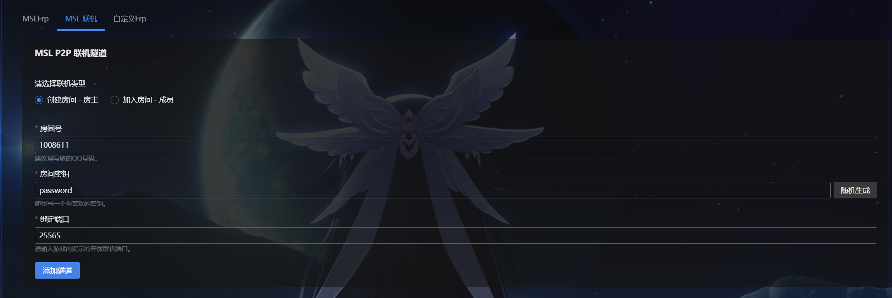
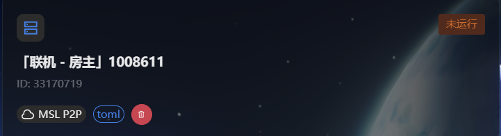
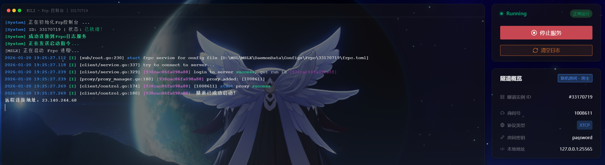
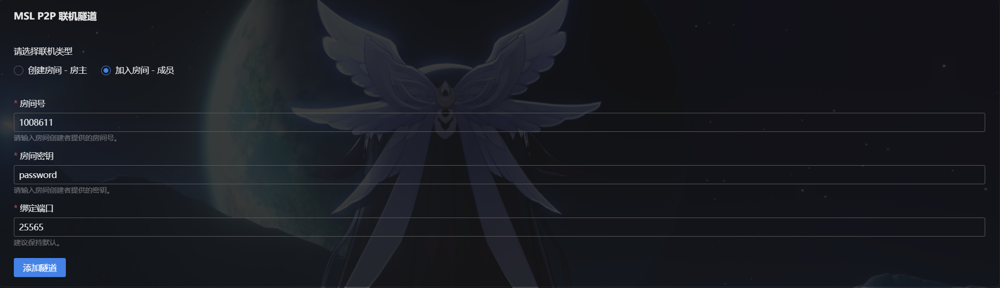
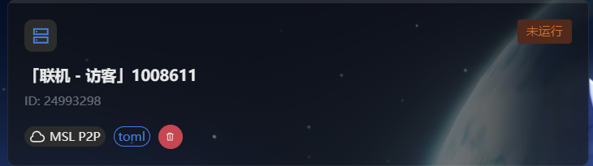
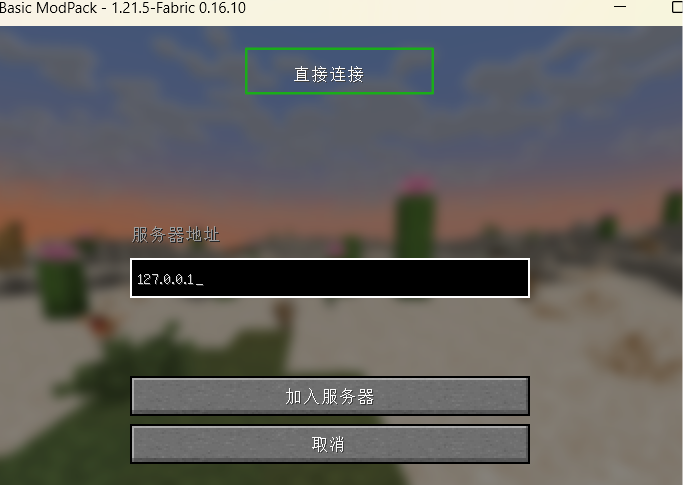

::: tip 互通提醒
MSL和MSLX的点对点联机功能是 ==互通== 的，换言之，房主可以使用MSLX开放，成员可以使用MSL加入房间，反之亦然。

此处演示使用MSLX，MSL的教程可以看这里。

[点对点联机教程 | MSL开服器](https://www.mslmc.cn/docs/proxy/p2p/){.readmore}

:::

::: tip TIPS
点对点联机功能 ==无法穿透所有类型的NAT== ，如果你无法成功联机，请使用 ==内网映射== 功能  
由于Minecraft的限制，可能仅 ==正版用户== 才能成功联机，若你是离线用户，请 ==开服务器== 或者安装相关模组进行联机。
:::

## 房主部分

:::: steps

1. 下载与你的客户端对应的自定义联机模组（这是可选的，但是用了模组可以固定端口 / 关闭正版验证）。

   [**mcwifipnp** 更高级联机设置 (LAN World Plug-n-Play)](https://www.mcmod.cn/class/4498.html){.readmore}

2. 启动游戏，进入一个单人世界。

3. 按ESC，呼出游戏菜单。

4. 点击 ==对局域网络开放== 。

   

5. 根据个人需要调整配置并确认。

   

6. 游戏左下角会给你一个 ==端口==，将此端口填入点对点联机的端口中。

   

7. 进入MSLX的 ==添加隧道== 页面，并选择 ==MSL联机==，然后填写房间号（建议是QQ号），以及密码（随便写即可）。

   

8. 配置完成后，进入隧道页面并选择刚才创建的联机房间，启动即可。

   ps：右侧 ==隧道概览== 处，点击房间号和密钥是可以直接复制的哦~

   

   

::::

## 成员部分

::: tip 提醒

如果联机成员使用的是 ==Windows== 系统，更推荐使用MSL加入联机房间，会更方便。

[点对点联机教程 | MSL开服器](https://www.mslmc.cn/docs/proxy/p2p/){.readmore}

:::

:::: steps

1. 进入MSLX ==添加隧道== 页面，将房主给你的QQ号（==房间号==），==密钥== 填入。

2. 端口号默认为25565即可，成员 ==无需像房主那样更改端口号== ，然后添加隧道即可。

   

3. 配置完成后，来到 ==隧道列表== ，进入刚才添加的隧道，启动即可。

   

4. 启动成功后，进入和房主 ==版本一致的Minecraft客户端== 。

5. 点击 ==多人游戏== 。

6. 点击 ==直接连接==（或 ==添加服务器==）。

7. 在地址栏填写`127.0.0.1`（如果你更改了端口号，请在127.0.0.1后面加上半角冒号+你更改后的端口号，如：127.0.0.1:12337）

   

8. 然后即可成功联机。

::::