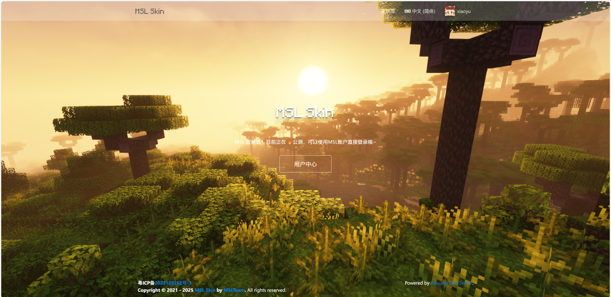
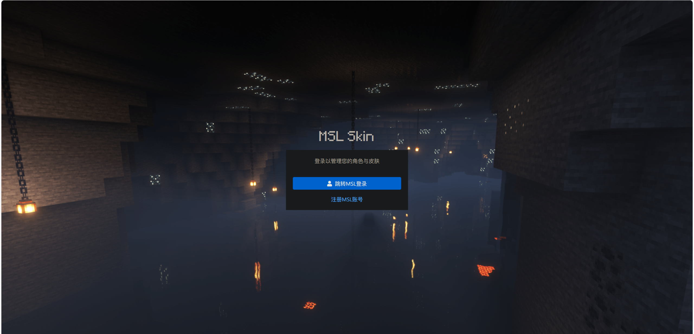
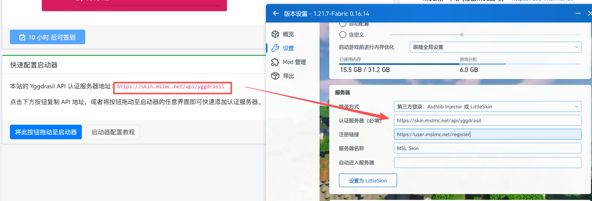
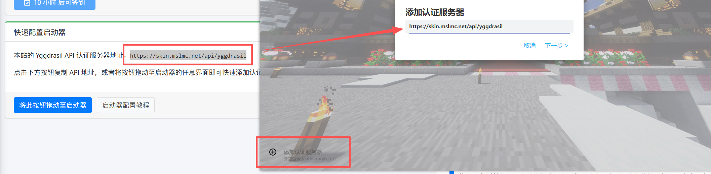
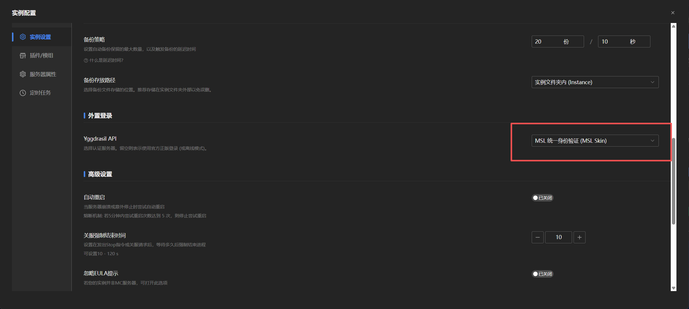

::: important ⚠️ 这并不能代替正版

==请始终考虑购买正版的 Minecraft。=={.important}

使用正版的 Minecraft 可以为你提供更省心的游玩体验。

:::

[MSL Skin (MSL皮肤站) ](https://skin.mslmc.net)是基于 [Blessing Skin](https://github.com/bs-community/blessing-skin-server/) 的一个MC皮肤站点，并且支持对接外置登录 Yggdrasil API 。

简单来说，MSL Skin可以提供联机时的 ==皮肤== 和 ==鉴权服务==，但不提供联机服务本身。

此站点由MSLTeam二次开发，深度对接了[MSL用户系统](https://user.mslmc.net)，使用统一的 ==MSL账号== 登录。

::: tip 有何优点？

- 只需要在启动器完成 ==一次登录== ，无需进服后再次输入`/login`。
- 方便的使用皮肤系统，而不需要打其他的补丁。
- 优雅的 ==账号控制==，其他人无法随意伪造您的用户名，也不能轻易注册多重账号，还可以防止服务器遭到假人压测。

:::

## 登录到MSL Skin

正如上文所说，MSL Skin使用的账号是您的 ==MSL账号== (即在MSL用户中心中注册的账号) ，进入MSL Skin网站登录时仅支持跳转MSL用户中心进行授权登录，==不支持账户密码登录==。如果您还没有MSL账号，您可以点击页面的注册按钮前往注册哦~

::: tip 关于默认角色名字

若您在MSL用户中心设置的昵称是符合角色名规范的，那么角色名将自动同步，若不符合命名规范，则会随机生成一个角色名，您可以在登录后自行修改。

:::

::: tip 关于UUID

本站采用了不兼容离线模式的UUID生成方式，即使您修改了游戏角色名，您的UUID也不会变化，换言之，==即使您修改了游戏角色名，您登录过的服务器玩家数据是不会变的==。

:::

::: tip 是否必须先登录皮肤站？

登录皮肤站 ==并非必须步骤==，您也可以按照下文配置好启动器外置登录后直接使用 ==MSL账户的账户密码==进行登录。但是如果需要修改角色名，还是需要前往皮肤站登录哦～

:::

## (玩家)游戏客户端配置&登录

目前主流的第三方启动器均支持配置外置登录，只需要填入MSL Skin页面提供的 ==外置登录API地址== 即可，如：

::: tip 

如果您是服主分发整合包，可以提前配置好外置登录后再分发游戏哦~

:::

然后直接使用 ==MSL用户中心== 的账户密码登录即可。

## (服主)在MSLX中开服并将MSL Skin作为外置登录验证服务器

非常简单，在 ==服务端设置== 中的 ==外置登录设置== 中选择 ==MSL统一身份认证== 即可。

::: tip

如果您使用自定义模式创建服务器，那么在创建时已经会有启用外置登录的引导。

若您使用的是快速模式，您需要配置完成服务器后再前往服务器设置页面启用外置登录。

:::

启动服务器，出现以下提示即为配置成功！

::: warning 注意

一旦您的服务器启用了MSL Skin外置登录，您的 ==所有玩家=={.warning} 必须在游戏客户端配置好外置登录地址并 ==登录MSL账号=={.warning} 才能加入服务器哦。

并且，您需要 ==开启正版验证=={.warning}，否则是无效的哦~

:::

## 使用MSL Skin登录进行联机

由于MC联机 (对局域网开放功能) 是默认存在 ==正版验证== 的，若离线登录是无法进行联机的。

此时便可以联机者均使用MSL Skin外置登录，即可顺利完成联机！

::: warning 注意

MSL Skin可以提供联机时的皮肤和鉴权服务，但 ==不提供联机服务本身=={.warning}。

:::
