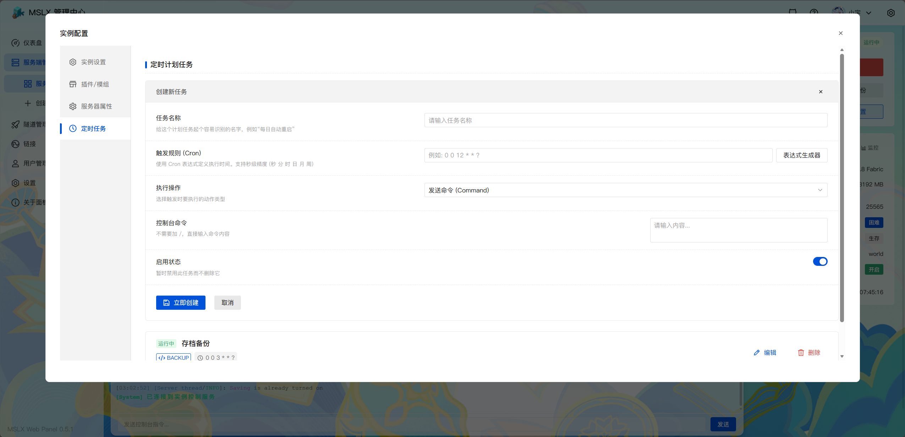
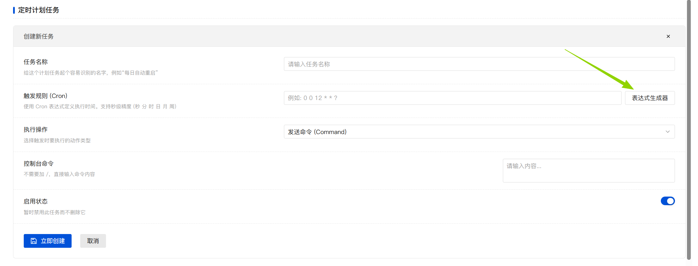
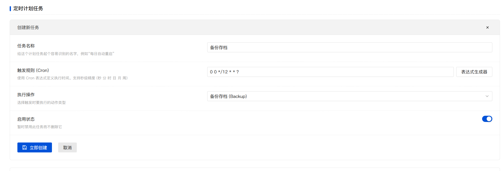
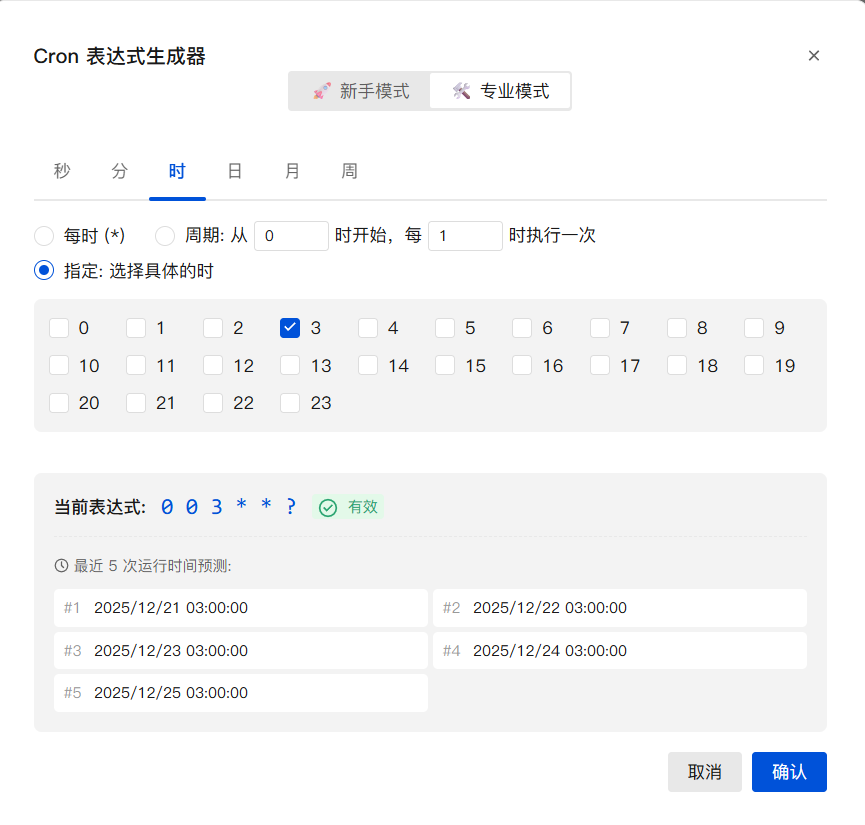
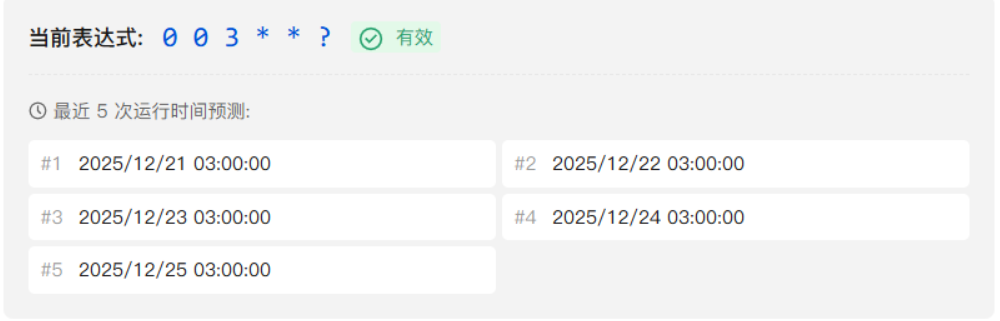

## 定时任务

MSLX 的定时任务对比原MSL的定时任务进行了全面的升级。

不仅支持 ==间隔性任务== 还支持 ==周期性任务== 。

支持的任务有：==开启/关闭/重启服务器、存档备份、发送指令== 。

## 配置定时任务

进入 ==服务端的设置弹窗== ，进入定时任务这一栏，开始进行配置。



定时任务是根据设置的 ==Cron表达式== 来决定执行的时间。

如果您熟悉Cron表达式的填写，那么就直接填写即可。

不会填写Cron表达式？没关系，我们也提供了可视化从编辑器。



### 时间间隔性任务

如果您只是想 `10分钟执行一次` 或者 `1小时执行一次`，那么可以直接在生成器的 ==新手模式== 下选择你喜欢的间隔，然后点击确定即可自动生成对应的表达式。（注意：只能填写整数哦）

::: demo-wrapper title="示例: 配置12小时执行一次备份的任务"

首先在表达式生成器中选择 ==单位== 为小时，然后填入 ==间隔的时间== 12小时即可。


点击确定，然后填写其他剩余的参数，保存即可。



:::

### 周期性任务

如果你想要 `每天的凌晨3点执行` / `每周的周一执行` ，那么 ==新手模式== 已经无法满足您的需求了，您需要切换到 ==专业模式== 。

看不懂如何配置？看下面的示例来理解一下吧！

::: demo-wrapper title="示例: 配置每天的凌晨3点执行"

`秒`: 指定为0秒 | `分`: 指定为0分 | `时`: 指定为3时

`日/月`: 保持默认为每周即可 | `周`: 这是可选配置，保持默认即可

最后的配置应该是这样的：



==注意：一定要把秒和分改成0或者一个你喜欢的秒，否则就会变成指定周期内每秒/每分钟执行一次...==

:::


::: tip 还是看不懂？

有一个更简单的办法，问AI就好咯......

示例提示词：

```
我想在每天凌晨3点执行一次任务，请告诉我这个任务的Cron表达式怎么写。
```

:::

### 验证表达式正确性

==建议使用哪种方法写的表达式都要看一下，避免出现奇怪的问题==

表达式生成器自带了 ==计算未来5次执行时间== 的功能，可以看一下这些时间是不是你所期望的，就能快速验证表达式的正确性了。


