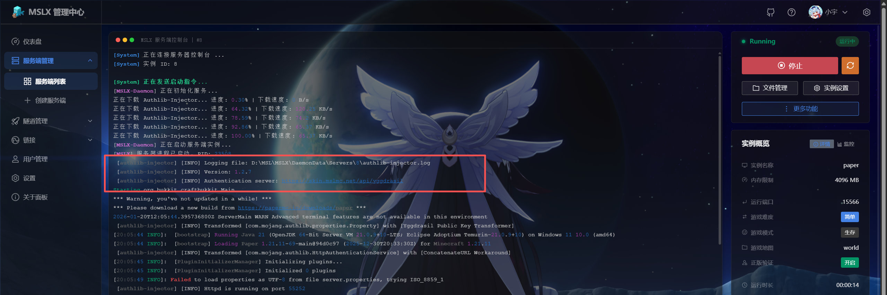

::: important ⚠️ 这并不能代替正版

请始终考虑购买 ==正版的 Minecraft=={.important} 。

使用正版的 Minecraft 可以为你提供更省心的游玩体验。

:::

::: warning 注意

一旦启用了外置登录，您的 ==所有玩家=={.warning} 必须使用 ==同一外置登录服务=={.warning} 进入游戏。

否则将无法正常加入服务器！

:::

## 配置外置登录

首先，在您的 ==外置登录提供服务的站点处== 获取外置登录 ==验证API地址==，然后直接填入 ==MSLX的服务端服务器实例设置== 中即可！

若您使用MSL Skin的服务，可以直接选择 ==设置为MSL统一身份验证== 即可。

<LinkCard title="MSL Skin" icon="cloud" href="/docs/msl/msl-skin/" description="MSL Skin是由MSLTeam提供的公共皮肤站+外置登录验证服务。 您也可以让您的服务器接入本服务。" />

若您使用Littleskin的服务，可以直接选择 ==Littleskin== 即可。使用其他的服务请选择 ==自定义== 并填入API地址。

然后记得点击 ==保存== 哦！

然后开启您的服务器即可，您 ==不需要做任何的额外工作== 。（MSLX将自动帮您下载最新版本的authlib-injector并嵌入您的服务端运行）

出现如下提示即为正常连接到您的外置登录服务。

::: warning 注意

您配置了外置登录验证后请务必开启原有的 ==正版验证=={.warning} 。

否则是无效的。

:::

## 自建外置登录服务（皮肤站）

使用此开源项目即可：

<RepoCard repo="bs-community/blessing-skin-server" />