::: tip 支持情况

官方基岩版服务端仅支持 ==Windows/Linux== 系统，

若您想使用macOS开基岩版服务器，请使用 ==容器== 运行MSLX。

[教程 -> **在 Docker 中部署 MSLX**](http://localhost:8080/docs/install/docker/){.readmore}

:::

## 快速搭建基岩版服务端

::: tip 这是 MSLX ==v1.3.3== 版本新增的功能，如果您正在使用更老的版本，请参考[手动添加基岩版服务端](#手动添加基岩版服务端)。

:::

:::: steps

1. ### 填写基本信息

   进入 ==创建服务端== 页面，右上角选择 ==基岩版== 模式。

   填写好名字和保存位置信息。!!忽略EULA提示的开关请保持打开，否则可能会出现怪异的现象......!!

   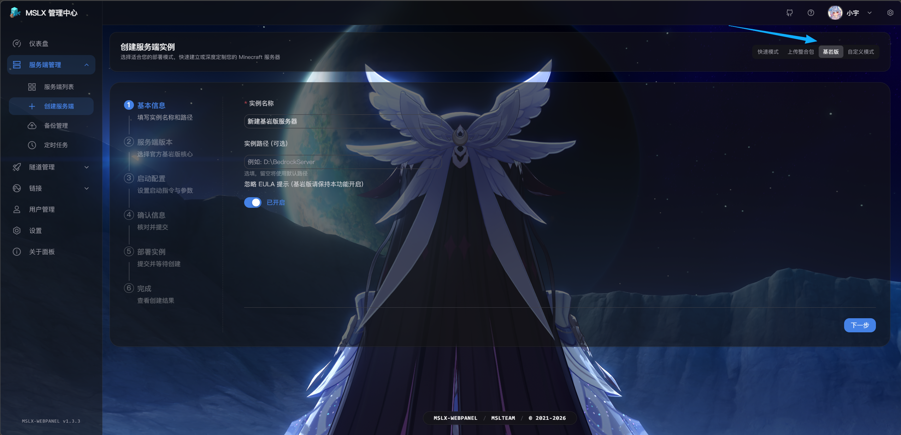

2. ### 选择游戏版本

   （release为正式版，beta为预览版，一般默认第一个即可）

   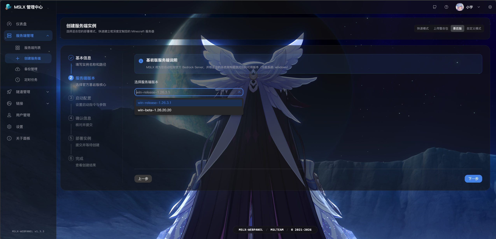

3. ### 配置启动指令

   没啥其他需要这里不需要改，直接 ==下一步== 就好。

   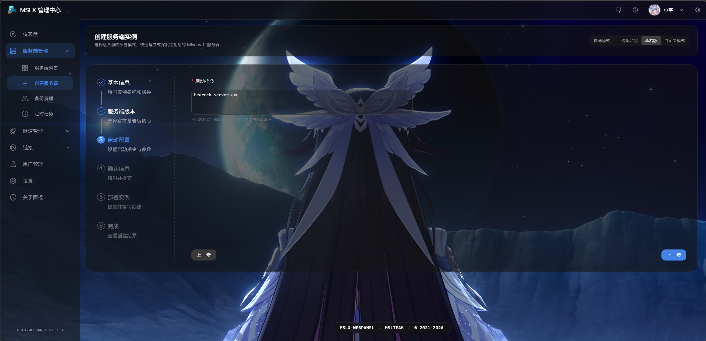

4. ### 提交创建

   确认信息无误后提交创建即可。

   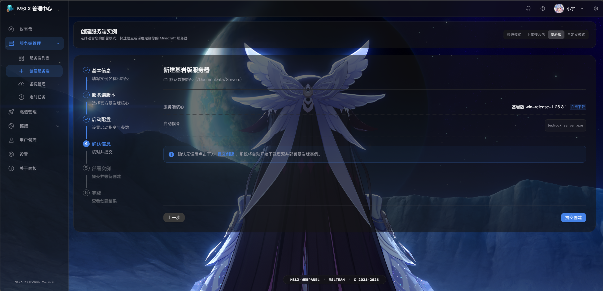

   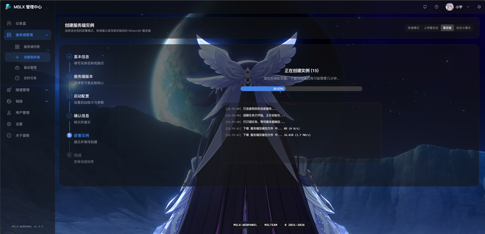

5. ### 开服 & 进入游戏

   进入新建的服务端的控制台，然后开启即可。

   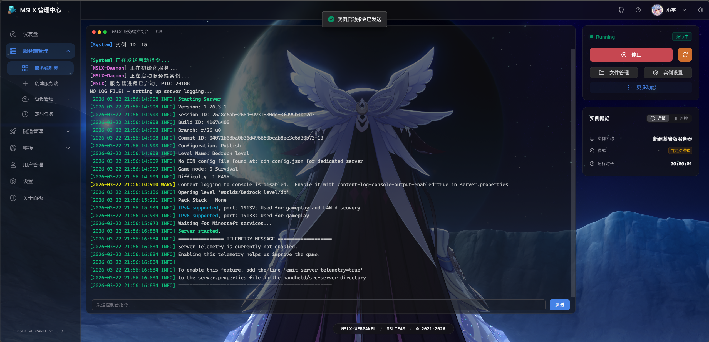

   配置内网映射和连接请参考 → [连接指南](#连接指南)。

6. ### 如何更新？

   进入 ==实例设置== → ==更多功能== ，在这里可以一键更新！

   ::: tip 更新前务必 ==备份存档！！！==

   :::

   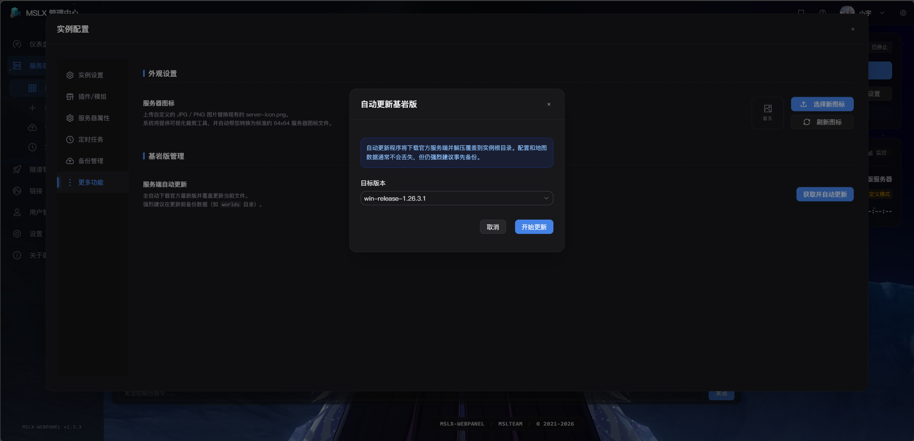

::::

## 连接指南

:::: steps

1. ### 配置内网映射

   ==基岩版使用的协议是udp==。

   ::: tip 

   如果您有公网IP或者是局域网游玩，可以略过这一步。

   但是如果需要本机进入本机的服务器，可能需要解除本地回环限制。（目前新版本基岩版似乎已经不是UWP应用了，可能已经不需要额外操作了）。

   [解除UWP应用本地回环限制](https://www.minebbs.com/threads/uwp.17877/){.readmore}

   :::

   以MSLFrp为例，配置协议为`udp`，本地端口默认为`19132`。

   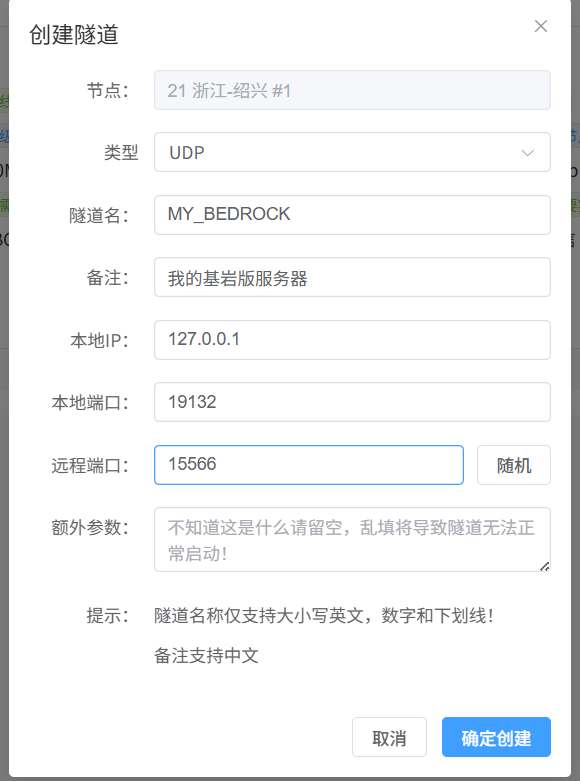

   创建隧道后进入MSLX的 ==隧道管理== 添加刚才的隧道，并启动即可。

2. ### 加入服务器

   内网映射成功后，你应该会得到一个类似这样的IP地址`xxx.xxx.xxx.xxx:15566`

   `xxx.xxx.xxx.xxx`即为IP地址，冒号后面的即为端口。  	

   按照下图示例输入即可。

   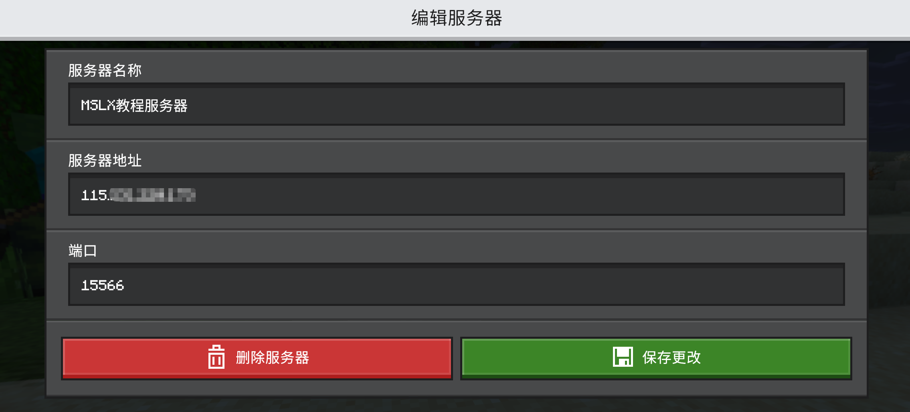

   然后畅快的游戏吧~

    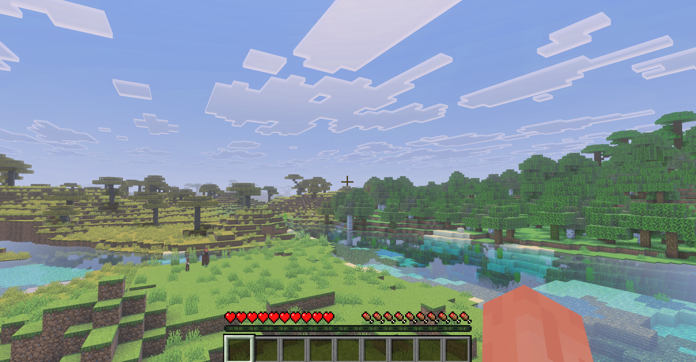

::::

## 手动添加基岩版服务端

:::: steps

1. ### 下载MC基岩版官方服务端

   <LinkCard title="基岩版服务器下载 | Minecraft" icon="download" description= "注意选择合适您系统的版本哦！" href="https://www.minecraft.net/zh-hans/download/server/bedrock" />

   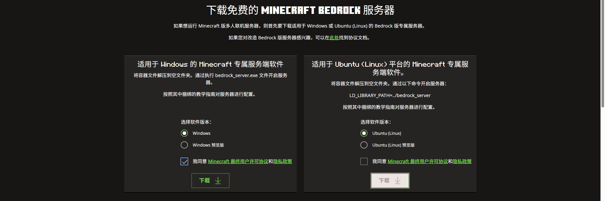

   <LinkCard title="服务端镜像站 | MSL用户中心" icon="download" description= "也可以前往MSL服务端镜像站下载相应的版本~" href="https://user.mslmc.net/mc-tools/download-server-core" />

   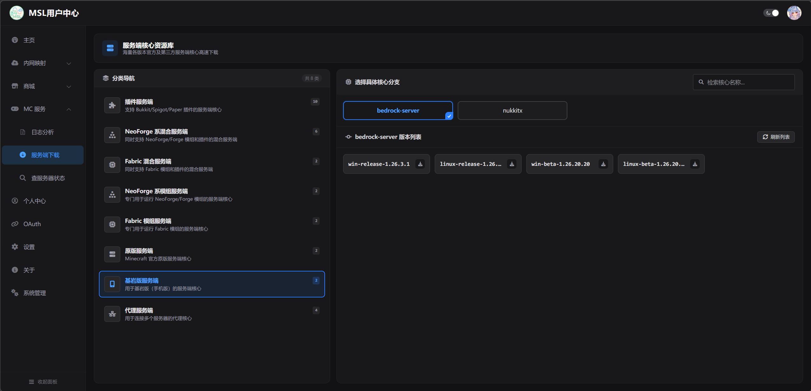

2. ### 添加服务端实例

   来到MSLX的 ==新建服务端== 页面，选择 ==自定义模式== 。

   填写服务器名称，路径（可选），启动指令如果是Windows系统请填写`bedrock_server.exe`如果是Linux系统请填写`./bedrock_server`，填写完成后提交创建即可。

   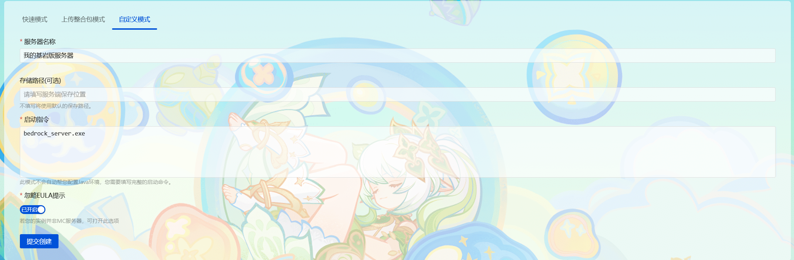

3. ### 上传&解压服务端文件

   前往刚才创建的服务端实例页面，进入 ==文件管理== ，将刚才下载的 ==基岩版服务端压缩包== 上传。

   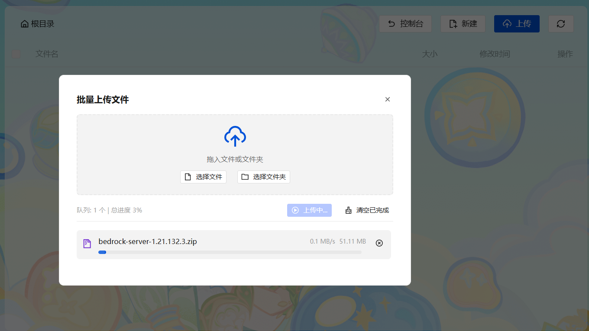

   上传成功后对此文件解压，注意 ==不要选择创建同名文件夹==。

   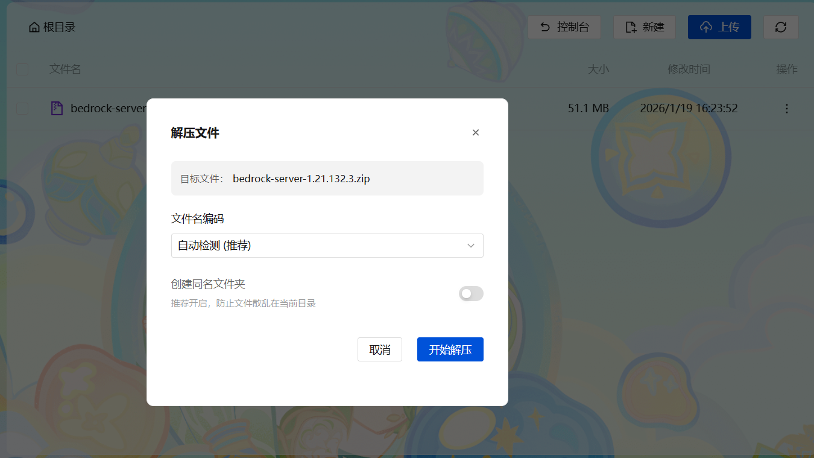

   解压出来是这样的。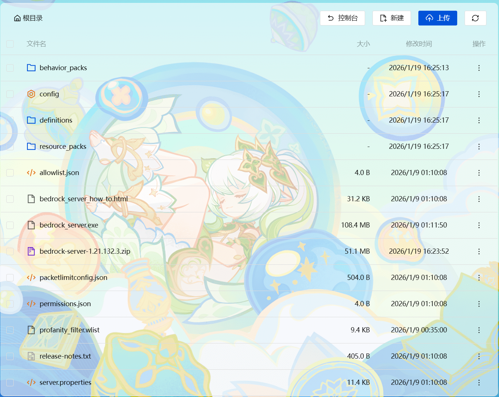

   ::: tip 设置可执行权限

   如果您正在使用Linux，请对着`bederock_server`文件设置 ==权限== 为755，都则可能无法运行。

   :::

4. ### 启动服务端

   返回控制台，即可启动服务端。出现`Server started.`字样即为启动成功。

   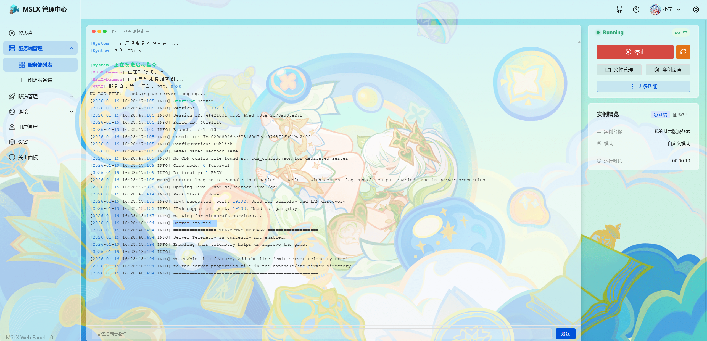

5. ### 配置内网映射/进入游戏

   参照上面的[连接指南](#连接指南)

::::