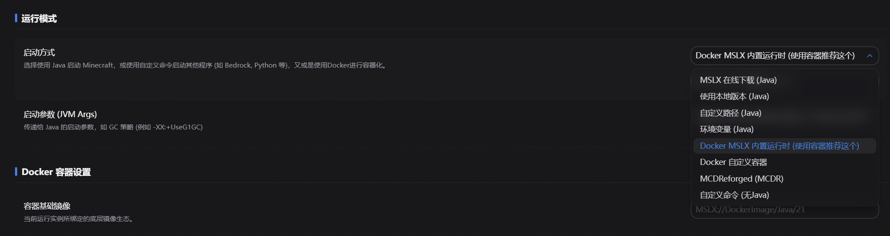
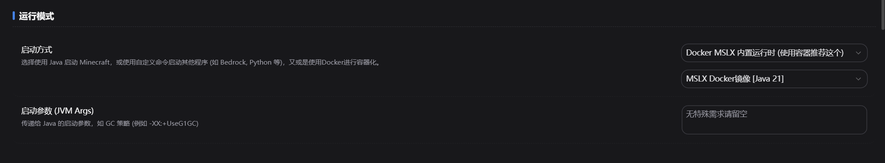
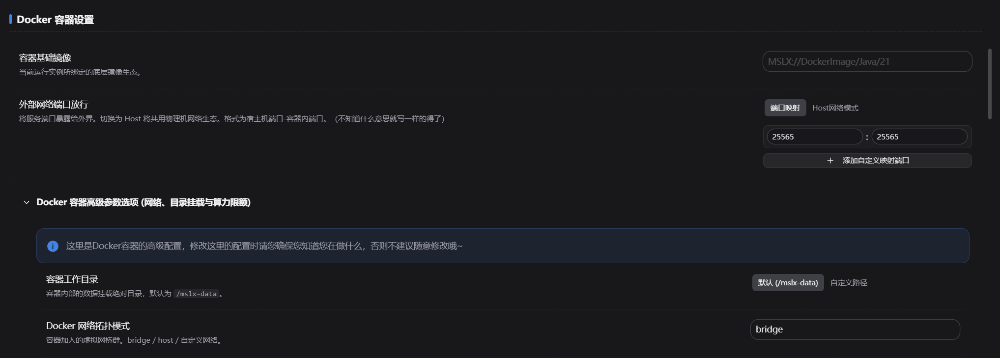

## 功能介绍

Docker为虚拟化容器，可以将服务端 ==运行在完全隔离宿主机== 的沙盒环境下，可以保护宿主机不受入侵。比较适合用于 ==分发== 资源，也自带限制CPU/内存/网络/磁盘资源的功能。MSLX 自`v1.5.0` 版本起支持此功能。

使用条件：==需要自行在宿主机安装Docker环境==。(Linux直接软件包管理器装，Windows/macOS需要安装Docker Desktop)。

::: tip Docker在 ==Linux== 上使用是最好的，如果在Windows/macOS上使用，性能损耗可能会比Linux上高（特别是磁盘性能）。

:::

## 创建一个Docker环境下的服务端

目前：`快速模式`、`整合包模式`、`自定义模式` 已完成对Docker服务端创建的支持。基岩版和MCDR还在开发中。（其实也能用，看会不会调了）。


在选择Java的阶段，直接选择 ==Docker容器环境== 。然后选择合适的Java版本即可。

就是这么简单，无需关心镜像那些内容，MSLX全程为您自动处理。


::: tip 关于内置运行时镜像

内置的官方运行时镜像为MSLX自行打包的Java运行时镜像，下载源位于中国大陆，拉取速度也很快。

镜像源默认**内置**了：==当前选择的Java版本运行环境+Python3+MCDR+基岩版所需运行环境。==

:::

接着，在 ==资源配置== 中填写端口配置。

不会填？你开服想用哪些端口，就左右填一样的就好，如：（这里示例使用25565和25566）


然后一直下一步就可以了，MSLX会自动处理那一堆东西。

::: warning 关于NeoForge/Forge安装

如果您在Windows/macOS环境下使用了Docker，并且正在创建需要安装NeoForge/Forge的服务端。安装时间可能会比宿主机安装 ==慢很多很多=={.warning} （因为磁盘挂载的问题），这是正常现象，请耐心等待。（比如1分钟变10分钟都是很正常的~）。

:::

## 调整Docker容器配置

### 对未启用Docker的服务端启用Docker托管

进入 ==「实例设置」== ，调整 ==运行方式== 。（如果是MC服务端，建议选择内置运行时，内置运行时就像选择Java一样选择一个版本即可。自定义的话需要自行指定容器镜像和完整的启动指令）。





### 调整高级设置

==除非你知道你在干什么，否则不要乱改哦==。

高级设置大部分都仅适用于分发资源的情况（你自己用就没必要限制资源叭qwq）。

此部分不做过多解释，面板内说明已经比较完善，若不理解可以查阅相关Docker文档/请教AI。



## MSLX已运行在Docker下，如何再部署Docker服务端实例？ <Badge type="tip" text="v1.5.1+" />

对于MSLX本身就安装在Docker的情况下，自`V1.5.1`版本起也做了相应的支持。

采用的模式为：`Docker Out Of Docker`，即创建的容器会在和MSLX的Docker为同一层，不是嵌套的关系（嵌套的性能损耗较大，尤其磁盘资源）。

### 前置条件

必须在MSLX运行的容器中 ==挂载了宿主机Docker的套接字== 才能运行，否则会报错哦！

只需要映射以下文件即可：

```shell
- /var/run/docker.sock:/var/run/docker.sock
```

如果你不知道改哪里，可以前往查看Docker安装文档，里面的配置文件均包含此项配置。

[在 Docker 中部署 MSLX](/docs/install/docker/){.readmore}

配置后，即可正常在MSLX中部署Docker服务端实例了。

### 挂载额外数据目录

如果您的服务端文件不在MSLX的默认数据目录，需要挂载的话，请保证 ==文件夹路径与挂载进Docker的路径一致==。

例如我的数据文件在`/game`，那么需要这样挂载：`/game:/game`。否则将无法在Docker容器中正常启动！
