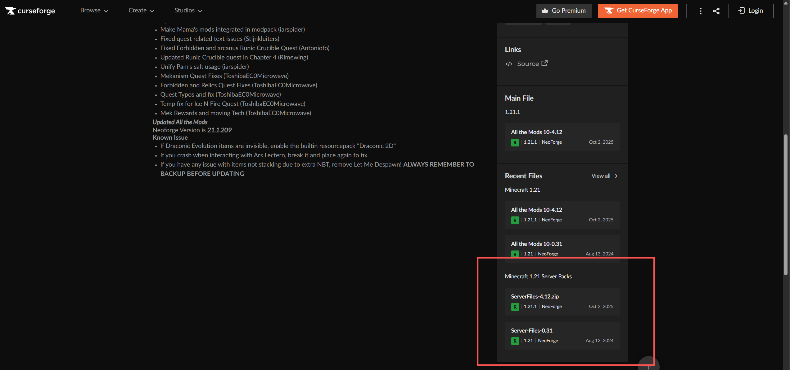
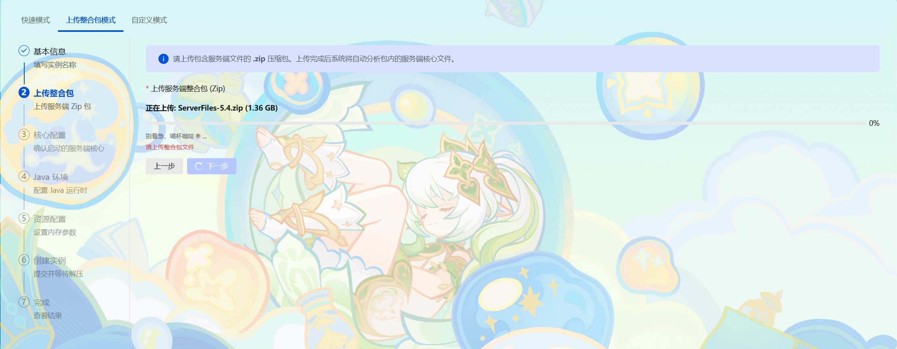
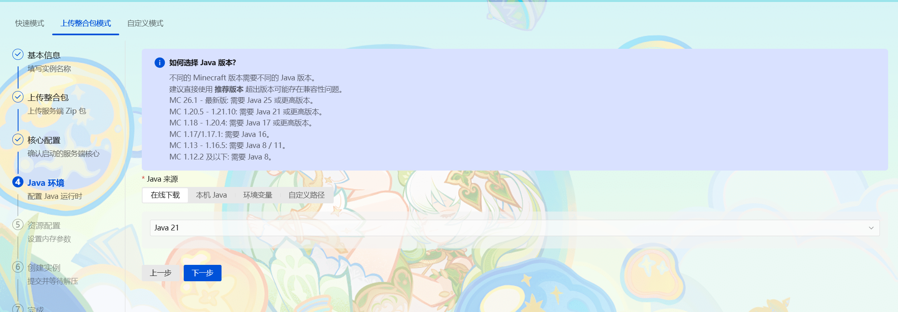
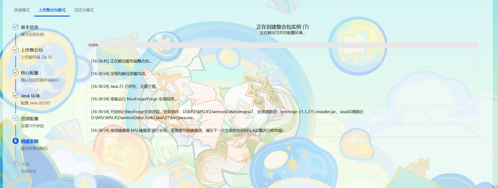
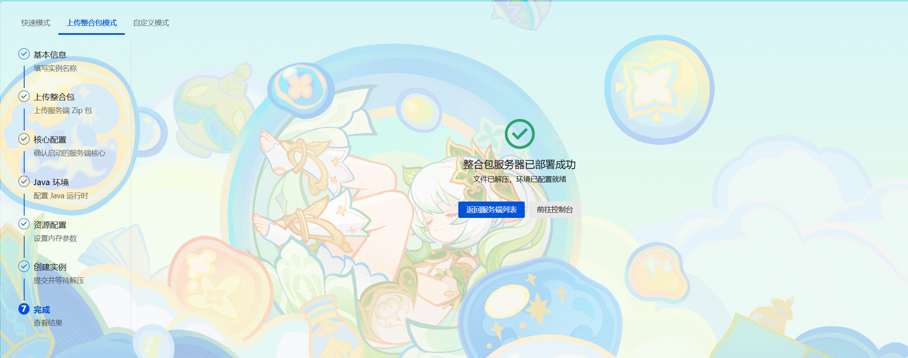

::: step

1. ## 下载服务端整合包

   首先，先确保你要导入整合包的类型为 ==服务端== （带有server或服务端字样）。

   就像这样，这里的才是 ==服务端整合包== ：

   

2. ## 导入服务端整合包

   来到MSLX的 ==创建服务端== 页面，选择 ==导入整合包== 模式，填写名称和路径后，选择刚才下载的服务端文件。

   

   上传成功后，进入 ==核心选择== 页面，正常情况下都会能检测到核心，如果没检测到，可以在核心库 ==选择和你整合包一样的模组加载器和版本== 即可。

   

   Java也是按照提示选择即可。

   

   提交创建，MSLX会自动完成整合包解压，Java环境部署，NeoForge安装等流程，稍等即可。

   

   部署成功即可去开服啦！

   

::::

::: warning

注意：部分整合包作者比较贴心，分为server和java这俩文件夹，此时你需要自己解压并且把server文件夹的东西压缩，然后才能导入。

:::

