::: tip 支持情况

MSLX 网页控制台自 ==v0.3.0-alpha== 版本起支持自定义一些主题配置。

==注意：使用自定义主题会在一定程度上影响文本的可阅读性，请酌情开启==

!!好看就行，管他呢！!!

:::

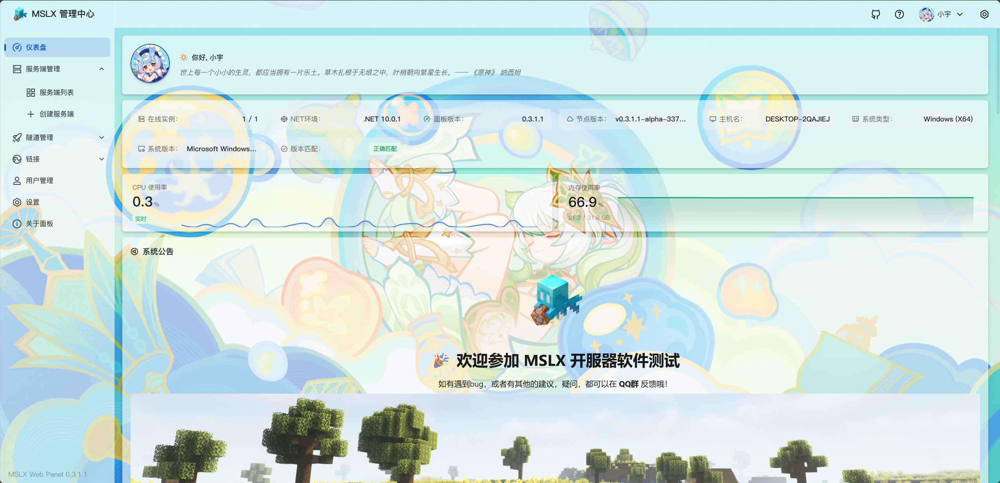

## 基础主题配置

::: important 配置不共享

在此面板下的任何配置调整都是仅适用于 ==当前浏览器=={.important} 。

当您更换了设备/浏览器，或者清空了浏览器的本地存储，这些都会被 ==重置=={.important} 。

:::

点击网页控制台右上角的设置图标，会进入基础主题配置的弹窗。

可以对：==主题模式== 、 ==主题色== 、 ==导航布局== 进行配置。（配置这三项一般不会影响文本的可阅读性）

::: tip 导航布局

第一个导航布局是经典侧边栏布局，第二个则是顶部菜单布局。

由于菜单项目较多，在PC端的顶部菜单布局下部分菜单项会被折叠成 ==更多== 菜单项。

这里建议PC端使用侧边栏布局，手机端可以切换到顶部菜单布局。!!当然，一切都是你喜欢就好啦~!!

:::

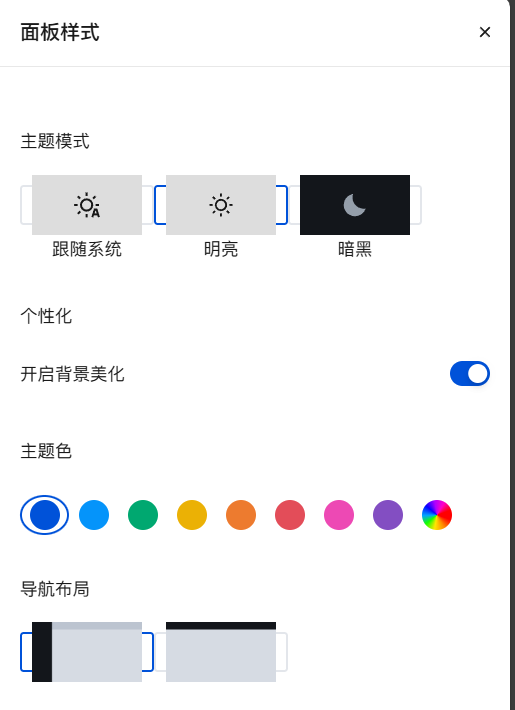

## 终端日志染色等级配置

::: tip 从MSLX Webpanel v1.1.3 版本起，新增对日志染色等级调整的功能

:::

以下为预览效果，可根据个人喜好进行选择，系统默认选择 v1.1.3 版本新增的 ==简约染色== 。

### 不染色

基本上是全黑/全白。原始返回。

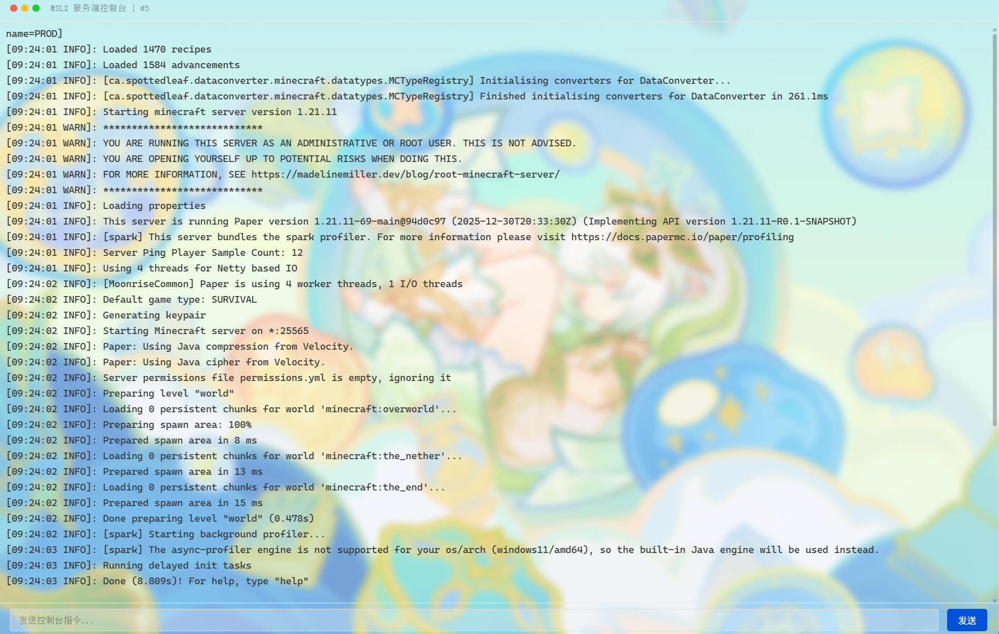

### 简约染色

这是新版本的默认模式，比较耐看吧。

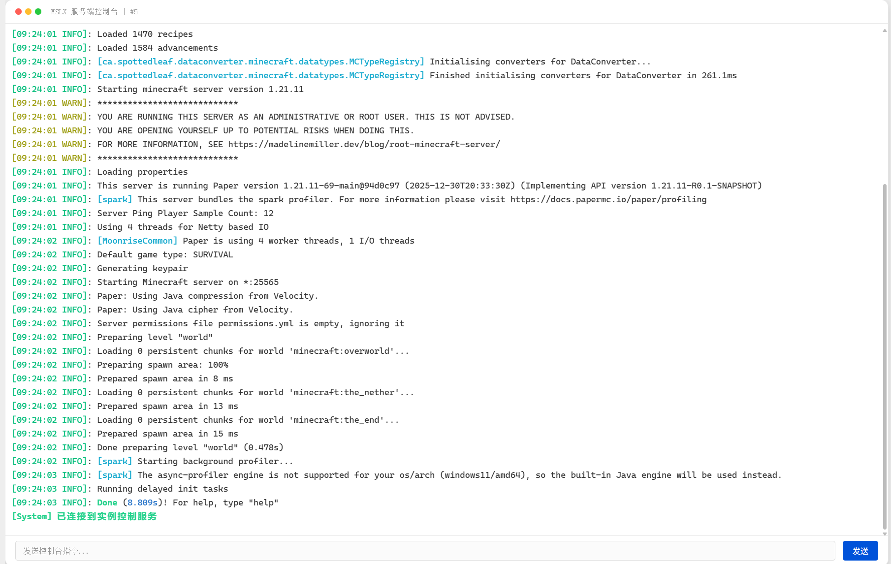

### 增强染色

这是老版本 （v1.1.2以及之前的版本）的默认染色模式，染色更丰富。

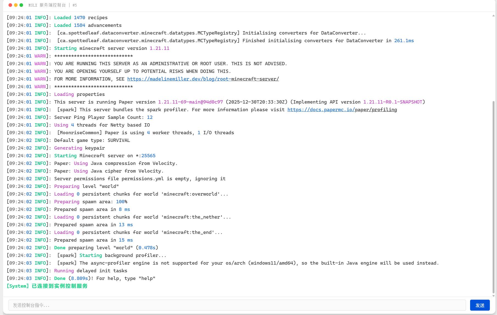

## 日志原彩显示功能

::: tip 在MSLX ==v1.1.7== 版本，我们新增了 ==日志原彩显示== 功能，可以在控制台上展现日志的原有颜色。此功能可以，也建议和下述的简约染色搭配使用。

:::

以下为预览效果，可根据个人喜好进行选择，系统默认选择 v1.1.3 版本新增的 ==简约染色== 且开启日志原彩显示 。

### 日志原彩 & 简约染色

混合日志的原本色彩配合MSLX进行额外的颜色渲染。

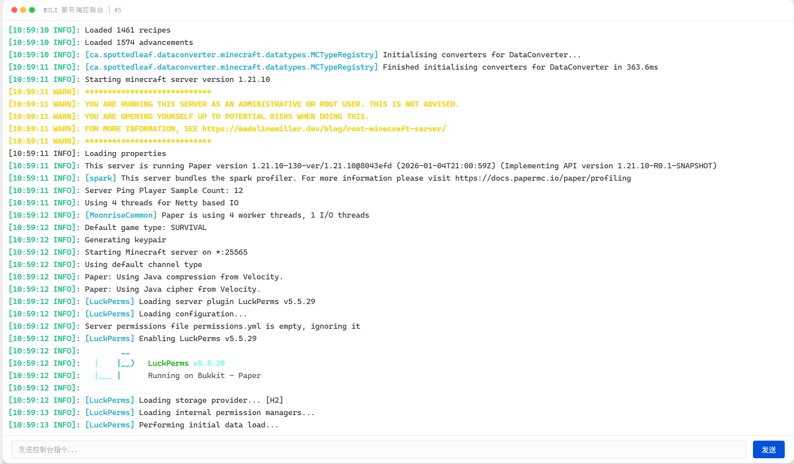

### 日志原彩 & 不染色

仅显示日志原本的色彩。

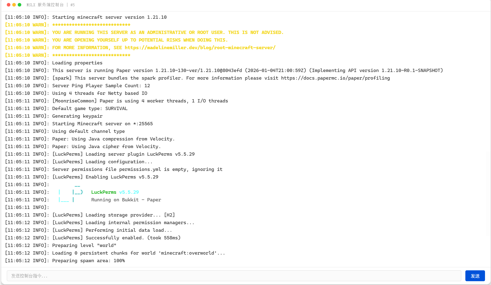

### 简约染色 & 不开启日志原彩

此模式下为仅使用MSLX给日志染色。

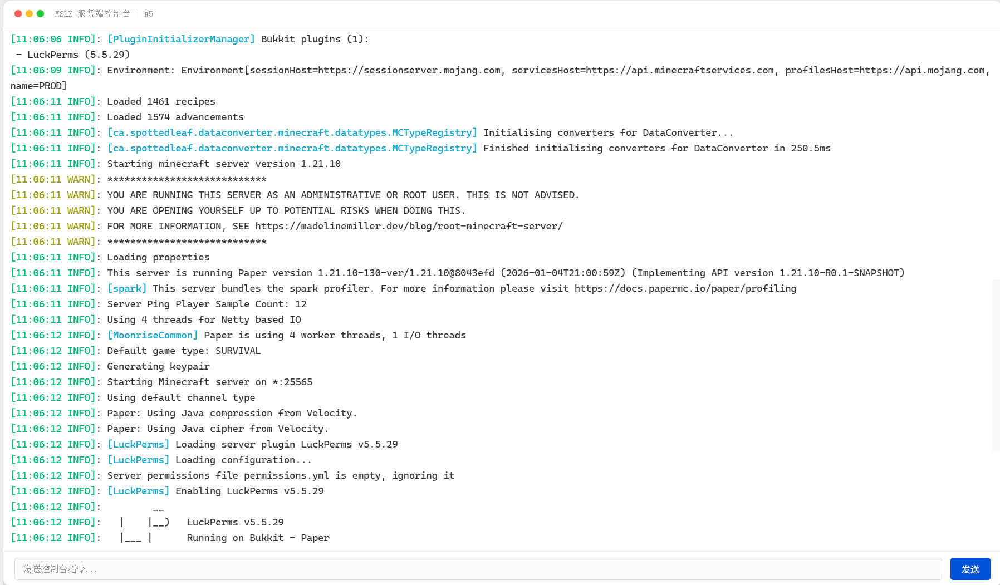

## 自定义背景图 (进阶配置)

再次说明：开启后，在对比默认主题下， ==文本可阅读性确实会降低== !!我不管！我不管！!!

::: important 配置共享

在以下配置的自定义设置均会被保存到 ==MSLX守护进程=={.important} 端的设置中。

是会 ==多端共享=={.important} 的。

:::

### 配置方法

首先，为了启用自定义背景，您需要在上方说到的配置面板中打开 ==开启背景美化== 。此时，默认背景将会加载。

然后从菜单栏进入 ==设置== 页面，即可开始配置您的主题。

如图，我们提供了以下的配置项（暗黑模式和明亮模式的配置均是分离的）：

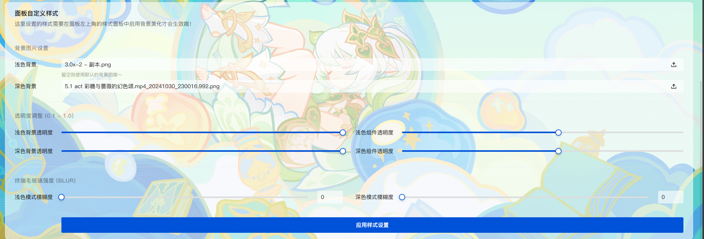

#### 1. 自定义背景

背景的设置支持填写 ==在线的资源地址== （如：`https://www.mslmc.cn/logo.png`）

也支持 ==本地上传== ，只需要添加填空框框的最右侧的上传按钮即可上传文件作为您的背景图。（图片文件大小不能大于 10 MB）

小建议：可以选择一些比较符合当前主题色调的图，不然真的很难阅读。!!无视风险，强制开启！!!

::: tip 实时预览

配置的项目在修改后是可以立即预览到效果的。

但是如果你调整的参数模式和您现在处在的模式不一样，您需要在上面所说的面板中调整到 ==目标模式== 才能预览到哦。

调到满意的效果再保存哦~

:::

#### 2. 透明度调整

透明度调整支持调整背景图片本身的透明度。

其中，背景的透明度：==数字越小，背景越不透明==。而组件透明度是：==数字越大，组件越不透明==。

!!听不懂这句话的意思吗？其实你拉一下调整一下就明白了，因为是实时调整的。!!

#### 3. 终端毛玻璃强度

由于设置页面和终端不在一个页面，所以 ==没办法做到实时预览== 。

这个参数设置的是终端的模糊程度（有些时候模糊一些可以提升文本的可阅读性）。

上图：==（毛玻璃强度 0 vs 毛玻璃强度 15）==

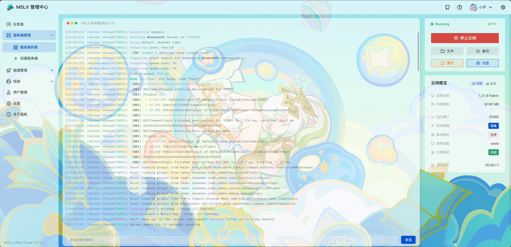

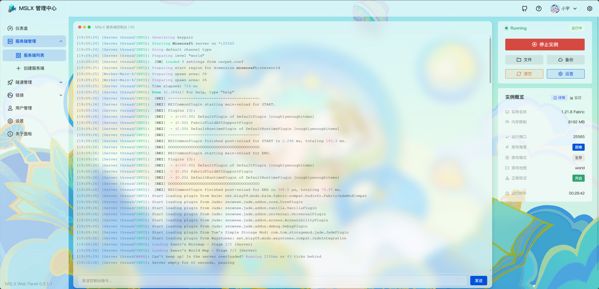

可以根据自己的喜好调整到合适自己的参数即可。

注意：这个强度并不是百分比，只能设置0-50。!!学过css的都知道，这里的单位其实是px。!!

### 上传图片的保存位置

在这里：`MSLX数据目录\DaemonData\Public\Images` 

MSLX数据目录一般都在守护进程端同一文件夹。

::: important 一些你需要知道的事情

- 当你嫌弃了你上一张背景图，重新上传了一张背景图后，以前这张图我们不会自动删除它，您需要自行去文件夹删除，或者，就留着吧。
- 如果您的面板暴露在了公网上，您需要知道，在这个文件夹里面的图片都能 ==无权限== 被公网访问。!!所以，不要在这个文件夹放一些奇怪的东西哦!!

:::

## 还是不满足？

!!你可真是个小馋猫啊!!

==留给你的只有一条路，那就是魔改前端代码的道路。==

前端项目在 `MSLX.Webpanel`内，需要环境`Node.JS 22 +` 。

!!如果你看不懂上面的话，那放弃吧~!!

<RepoCard repo="MSLTeam/MSLX" />

若你选择魔改前端，你会享受到 ==魔法对轰之 — CSS 大作战==。

目前，自定义背景图的实现均在`MSLX.Webpanel/src/layouts/index.vue`内，已经 ==魔法对轰== 了很多内容了。
