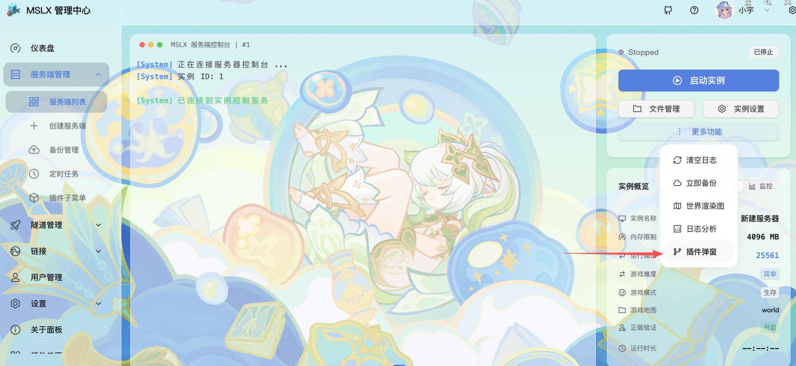
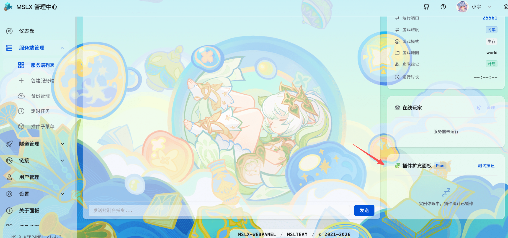
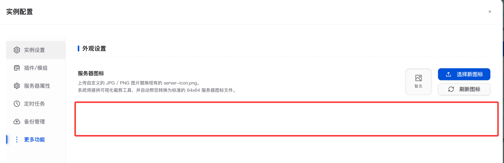

## 概述

::: important 使用插槽注入自定义组件时，请尽量让您的设计样式和原页面保持一致。

:::

MSLX 的插件系统允许您在原有页面的一些槽位新增组件/插入下拉菜单，效果如下：


新增的组件注入均在插件的 ==入口文件== 中导出的 `pluginConfig` 集合中的 `extensions` 数组。

具体示例可参考 ==mslx-plugin-demo== 插件的插件入口示例：[mslx-plugin-demo/Frontend/src/pluginEntry.ts at main · MSLTeam/mslx-plugin-demo](https://github.com/MSLTeam/mslx-plugin-demo/blob/main/Frontend/src/pluginEntry.ts)

本文档将展示所有支持的插槽。其中徽章指示代表该插槽支持的最低MSLX SDK版本。<Badge color="#8e5cd9" bg-color="rgba(159, 122, 234, 0.16)" text="Version" />

## 配置示例

:::: field-group

::: field name="extensions[i].slot" type="string" required
插槽名字（见本文档）
:::

::: field name="extensions[i].component" type="string" required
嵌入的组件（需要在上方import）
:::

::::

以上两项为插槽的通用配置，如插槽有其他配置项（例如`label`）,会在下方文档补充说明。

```ts
    extensions: [
        {
            slot: 'instance-console-dropdown', // 注入到实例控制台更多功能的下拉菜单
            component: InstanceDropDownItemInject, // 弹窗组件
            label: '插件弹窗', // 下拉子菜单名
            icon: GitBranchIcon, // 下拉子菜单Icon
        },
        {
            slot: 'instance-console-overview-bottom', // 注入到实例控制台玩家卡片下方
            component: InstanceCardInject, // 组件
        }
    ]
```


## 服务端管理-实例控制台-更多功能菜单插槽 

插槽名：`instance-console-dropdown` <Badge type="tip" text="v1.4.3" />

在此页面的 ==更多功能== 下拉菜单处新增一个菜单项，点击该菜单应该新显示一个 `t-dialog` 组件。

此插槽需要新增以下配置项：

:::: field-group

::: field name="extensions[i].label" type="string" required
新增的下拉菜单的名字
:::

::: field name="extensions[i].icon" type="component" required
嵌入的图标组件（需要是TDesign的图标组件）
:::

::::

```ts
        {
            slot: 'instance-console-dropdown', // 注入到实例控制台更多功能的下拉菜单
            component: InstanceDropDownItemInject, // 弹窗组件
            label: '插件弹窗', // 下拉子菜单名
            icon: GitBranchIcon, // 下拉子菜单Icon
        },
```



此外，为了能正常触发`t-dialog`的显示，需要在插入的组件中暴露一个`open`方法给宿主。

```ts
// 暴露接口给宿主
defineExpose({
  open: () => {
    console.log('👉 [插件内部] open 方法被成功触发！');
    visible.value = true; // 显示弹窗
  }
});
```

可接收props：

```ts
const props = defineProps({
  serverId: Number
});
```


简单的弹窗组件示例在这里：[mslx-plugin-demo/Frontend/src/views/InstanceDropDownItemInject.vue at main · MSLTeam/mslx-plugin-demo](https://github.com/MSLTeam/mslx-plugin-demo/blob/main/Frontend/src/views/InstanceDropDownItemInject.vue)

## 服务端管理-实例控制台-左侧控制栏下方插槽

插槽名：`instance-console-overview-bottom` <Badge type="tip" text="v1.4.3" />



可接收props：

```ts
const props = defineProps({
  serverId: {
    type: Number,
    required: true
  },
  status: {
    type: Number,
    default: 0
  }
});
```

示例插入组件：[mslx-plugin-demo/Frontend/src/views/InstanceCardInject.vue at main · MSLTeam/mslx-plugin-demo](https://github.com/MSLTeam/mslx-plugin-demo/blob/main/Frontend/src/views/InstanceCardInject.vue)

## 服务端管理-实例控制台-实例设置-更多功能插槽

插槽名：`instance-setting-more` <Badge type="tip" text="v1.4.8" />



可接收props：

```ts
const props = defineProps({
  serverId: {
    type: Number,
    required: true
  }
});
```

## 仪表盘-系统状态监控卡片下方插槽

插槽名：`dashboard-index-after-system-status` <Badge type="tip" text="v1.4.3" />


## 隧道管理-隧道控制台-隧道信息下方插槽

插槽名：`frp-console-control-panel-bottom` <Badge type="tip" text="v1.4.3" />


可接收props：

```ts
const props = defineProps({
  frpId: {
    type: Number,
    required: true
  },
  isRunning: {
    type: Boolean,
    default: false
  }
});
```

## 隧道管理-创建隧道-隧道服务商插槽

插槽名：`frp-create-provider` <Badge type="tip" text="v1.4.4" />

此插槽需要新增以下配置项：

:::: field-group

::: field name="extensions[i].label" type="string" required
新增的隧道服务商名字（会显示在切换按钮）
:::

::::

```ts
        {
            slot: 'frp-create-provider', // 注入到创建Frp的选项卡
            component: DemoPage, // 组件,
            label: '插件扩展服务', // 选项卡名字
        }
```


## 设置-基础设置下方卡片插槽

插槽名：`settings-profile-bottom` <Badge type="tip" text="v1.4.3" />


## 设置-系统设置下方卡片插槽

插槽名：`settings-daemon-bottom` <Badge type="tip" text="v1.4.5" />


