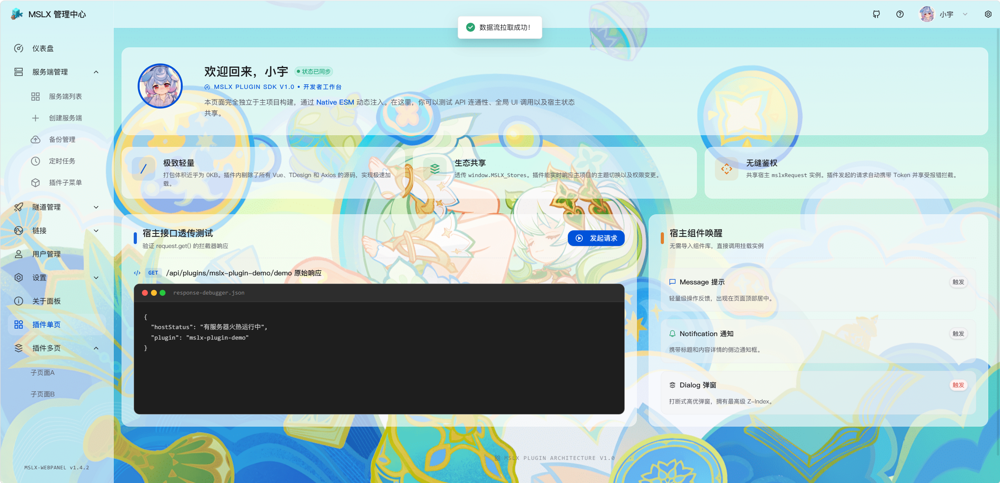

## 概述

MSLX 的插件系统允许您在网页控制台的前端新增菜单路由，效果如下：



新增的菜单配置均在插件的 ==入口文件== 中导出的 `pluginConfig` 集合中的 `routes` 数组。

具体示例可参考 ==mslx-plugin-demo== 插件的插件入口示例：[mslx-plugin-demo/Frontend/src/pluginEntry.ts at main · MSLTeam/mslx-plugin-demo](https://github.com/MSLTeam/mslx-plugin-demo/blob/main/Frontend/src/pluginEntry.ts)

## 新增一级菜单

:::: field-group

::: field name="path" type="string" required
新增的路由地址
:::

::: field name="name" type="string" required
路由名字（建议带上插件名字，以防和其他插件或宿主冲突）
:::

::: field name="component" type="string" required default="HOST_LAYOUT"
新增一级菜单请填写 ==HOST_LAYOUT== 即可
:::

::: field name="meta.title" type="string" required
新增的菜单标题
:::

::: field name="meta.icon" type="string" required
新增菜单的icon （仅支持使用tdesign的icon组件哦）
:::

::: field name="meta.roleCode" type="array"
新增菜单的可见范围，默认是所有用户可见
:::

::: field name="children[0].path" type="string" required
新增的路由地址（因为是新增一级菜单，这里一般留空即可）
:::

::: field name="children[0].name" type="string" required
子路由名字（建议带上插件名字，以防和其他插件或宿主冲突）
:::

::: field name="children[0].component" type="string" required
插入的组件（需要在插件入口顶部Import相应组件）
:::

::: field name="children[0].meta.title" type="string" required
新增的菜单标题
:::

::: field name="children[0].meta.hidden" type="boolean" required
由于是只有一级菜单，这里直接填 `true`。（注：将子路由设为 hidden 是为了在侧边栏仅显示一级菜单项，而点击时渲染该子路由组件。）
:::

::: field name="children[0].meta.roleCode" type="array"
新增菜单的可见范围，默认是所有用户可见
:::

::::

```ts
        {
            path: '/plugin-single',
            name: 'PluginSingleBase',
            component: 'HOST_LAYOUT',
            meta: { title: '插件单页', icon: 'app', roleCode: ['admin', 'user'] },
            children: [
                {
                    path: '',
                    name: 'PluginSingle',
                    component: DemoPage,
                    meta: { title: '插件单页', hidden: true, roleCode: ['admin', 'user'] },
                },
            ],
        },
```

## 新增一级和二级菜单

:::: field-group

::: field name="path" type="string" required
新增的一级路由前缀地址
:::

::: field name="name" type="string" required
一级路由名字（建议带上插件名字，以防和其他插件或宿主冲突）
:::

::: field name="component" type="string" required default="HOST_LAYOUT"
新增一级菜单请填写 ==HOST_LAYOUT== 即可
:::

::: field name="meta.title" type="string" required
新增的一级菜单标题
:::

::: field name="meta.icon" type="string" required
新增一级菜单的icon （仅支持使用tdesign的icon组件哦）
:::

::: field name="meta.roleCode" type="array"
新增一级菜单的可见范围，默认是所有用户可见
:::

::: field name="children[i].path" type="string" required
新增的二级菜单路由地址
:::

::: field name="children[i].name" type="string" required
二级菜单路由名字（建议带上插件名字，以防和其他插件或宿主冲突）
:::

::: field name="children[i].component" type="string" required
插入的组件（需要在插件入口顶部Import相应组件）
:::

::: field name="children[i].meta.title" type="string" required
新增的二级菜单标题
:::

::: field name="children[i].meta.icon" type="string"
新增二级菜单的icon （仅支持使用tdesign的icon组件哦）
:::

::: field name="children[i].meta.roleCode" type="array"
新增菜单的可见范围，默认是所有用户可见
:::

::::

```ts
        {
            path: '/plugin-multi',
            name: 'PluginMultiBase',
            component: 'HOST_LAYOUT',
            meta: { title: '插件多页', icon: 'layers', roleCode: ['admin', 'user'] },
            children: [
                {
                    path: 'page-a',
                    name: 'PluginMultiA',
                    component: DemoPage,
                    meta: { title: '子页面A', roleCode: ['admin', 'user'] },
                },
                {
                    path: 'page-b',
                    name: 'PluginMultiB',
                    component: DemoPage,
                    meta: { title: '子页面B', roleCode: ['admin', 'user'] },
                },
            ],
        },
```

## 插入原有一级菜单

:::: field-group

::: field name="parentName" type="string" required
需要插入的一级菜单的名字，可以在这里查询可选值，下面也列出来常见的三个一级菜单：

[MSLX/MSLX.WebPanel/src/router/modules at dev · MSLTeam/MSLX](https://github.com/MSLTeam/MSLX/tree/dev/MSLX.WebPanel/src/router/modules)

- `instance` (服务端管理)
- `frp` (隧道管理)
- `settingsBase` (设置)

:::

::: field name="path" type="string" required
插入的二级菜单路由地址
:::

::: field name="name" type="string" required
路由名字（建议带上插件名字，以防和其他插件或宿主冲突）
:::

::: field name="component" type="string" required
导入组件（记得import哦）
:::

::: field name="meta.title" type="string" required
新增的二级路由菜单标题
:::

::: field name="meta.icon" type="string" required
新增二级菜单的icon （仅支持使用tdesign的icon组件哦）
:::

::: field name="meta.roleCode" type="array"
新增菜单的可见范围，默认是所有用户可见
:::

::::

```ts
        {
            parentName: 'instance',
            path: 'plugin-extra',
            name: 'PluginNestedSetting',
            component: DemoPage,
            meta: { title: '插件子菜单', icon: 'control-platform', roleCode: ['admin', 'user'] },
        }
```

