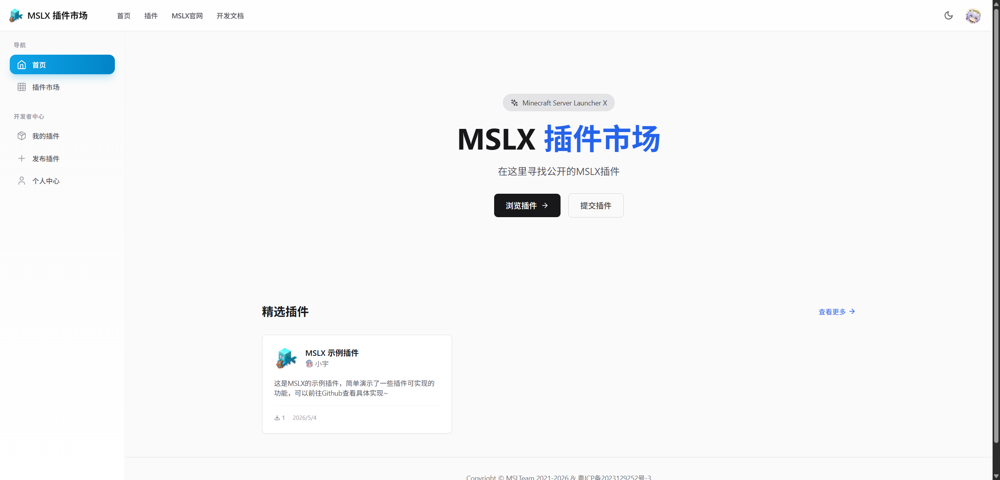
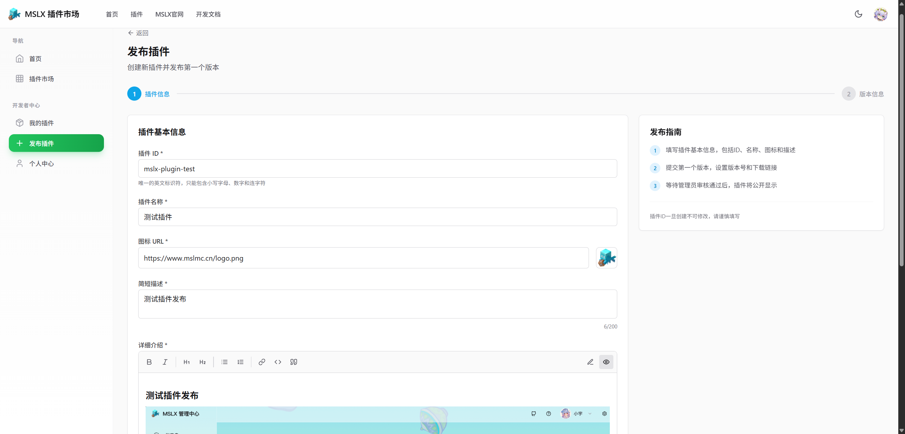
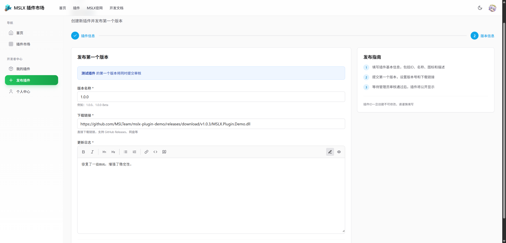
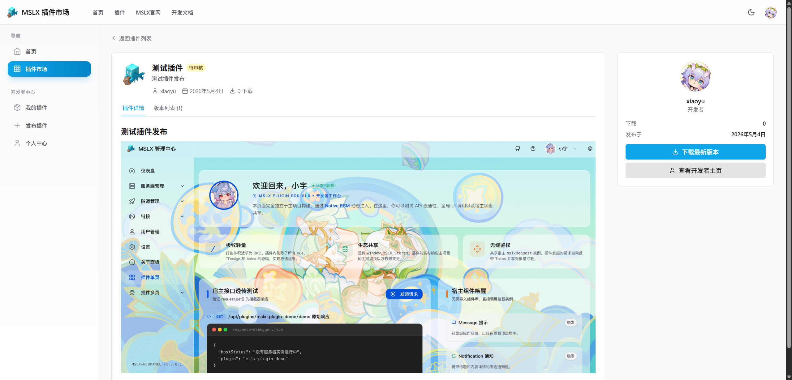
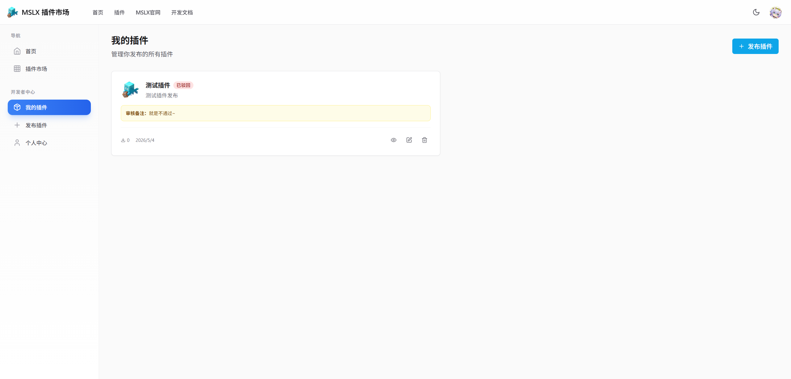
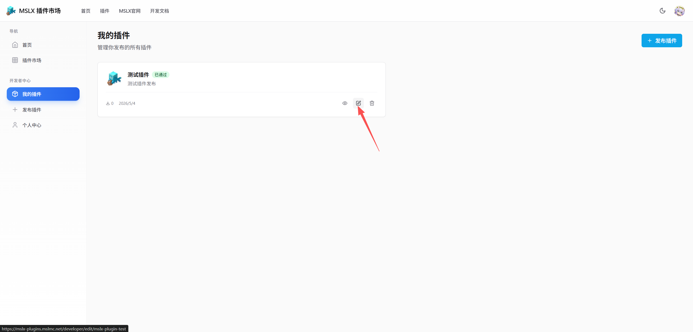
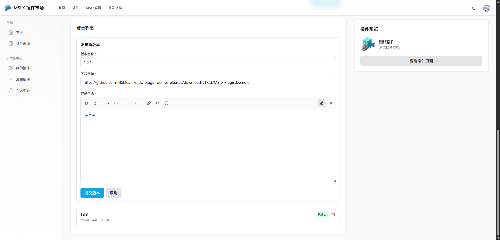

## 发布插件到MSLX插件市场

::: tip 目前插件市场独立站点的UI做的比较粗糙，后续会优化，目前能用就行QWQ

:::

<LinkCard title="MSLX 官方插件市场" icon="shop" href="https://mslx-plugins.mslmc.net" description="MSLX 官方维护的插件市场，可以在MSLX内一键安装和更新插件~" />

:::: steps

1. ### 登录到MSLX插件市场

   点击 ==登录== 会自动跳转到 ==MSL用户中心== 进行授权登录，若没有账号需要注册下。

   

2. ### 填写插件信息

   插件ID必须以`mslx-plugin-`开头，否则无法提交。

   名称，图标，介绍（支持Markdown）自己填写即可。（支持使用图片，但是只能通过图床上传）。

   如果没有图标，请填写：`https://www.mslmc.cn/logo.png`。

   

3. ### 发布第一个版本

   点击下一步后进入版本页面，填写插件版本号（请和插件内填写的元数据一致）。

   以及填写更新日志和下载地址。!!修复了一些BUG，增强了稳定性。!!

   下载地址 ==不允许填写网盘地址== ，可以是直链，也可以是Github Release复制的文件地址。

   

   

4. ### 等待审核完成

   提交后会跳转到预览到插件详情页面，等待审核即可。

   ::: important 每次修改插件详情都需要进入审核阶段，但是发布新版本只会审核新版本，不影响现有插件详情和老版本的展示。

   :::

   

   如果不通过，那么会在 ==我的插件== 页面显示原因，可根据原因再次进行修改提交。

   

5. ### 迭代发布新版本

   进入插件的编辑页面，划到最下面，==新增版本== 。

   填写信息后提交即可。

   

   

::::
