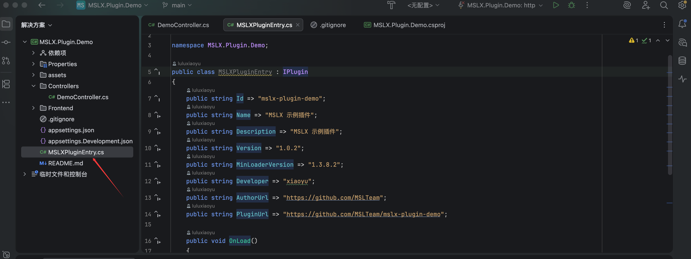
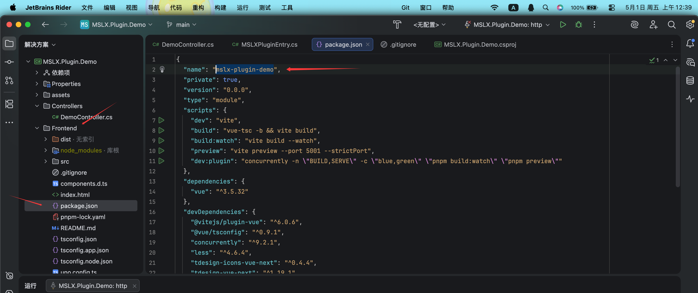
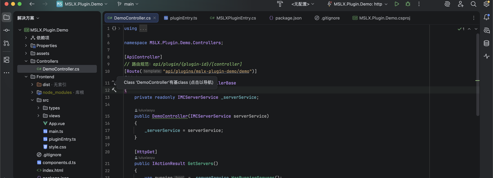
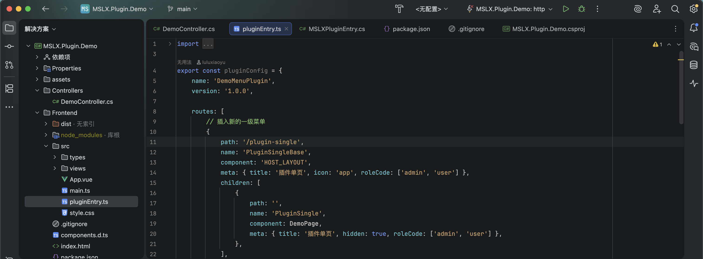

## 插件示例示例项目

插件的示例项目提供了简单的路由案例 + MSLX 内一些方法的调用示例 + MSLX 的配置读取示例。

!!随便改改模板就是一个新的插件是吧QWQ。!!

<RepoCard repo="MSLTeam/mslx-plugin-demo" />

## 必须修改的地方

如果您想简单一点直接使用插件模板进行二次开发，那么根据以下步骤修改插件信息即可。

### 插件元数据

在插件的入口文件`MSLXPluginEntry.cs`中，对`Id`等信息进行修改。

Id是必须要改的，其他的可以根据自己的喜好进行填写，Id的规范为：`mslx-plugin-xxx`。

起名前建议到Github查询是否存在同名插件，以防撞车。

然后`Version`必须是规范的版本号格式，例如`1.0`/`1.0.0`/`1.0.0.0`，如果需要添加beta/dev，可以使用`1.0-dev`此类。

### 前端项目名

进入`Frontend/package.json`,修改`name`参数，和上述元数据的`Id`一致即可。

::: important 这里很重要，必须修改，否则可能造成CSS污染

:::

## 开始开发

改完上述内容后就可以开始对插件进行定制想要的功能了。

后端可供调用的方法可以查阅：[MSLX.SDK](https://github.com/MSLTeam/MSLX/tree/dev/MSLX.SDK) 。

路由都应该写在`Controllers`命名空间下，具体写法也可以参考`DemoController`。

前端插件的注册入口在`PluginEntry.js`。可以参考路由组件是如何进行注册的。

